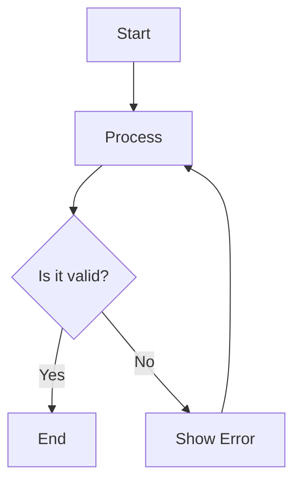
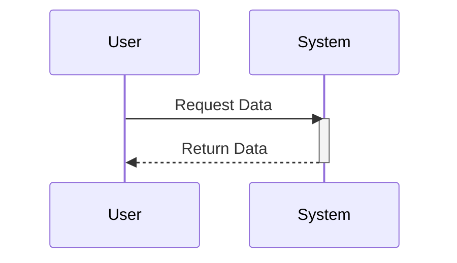

# Draw Mermaid Diagrams

## Instructions

When the user asks to create a diagram or visualize a process, use Mermaid syntax within Markdown code blocks.

1. **Identify the Diagram Type**: Determine the best diagram type for the user's request (e.g., Flowchart for processes, Sequence Diagram for interactions, ER Diagram for data structures).
2. **Consult the Specification**: Refer to `SPEC.md` for syntax details if needed.
3. **Generate Markdown**: Output the diagram inside a `mermaid` code block.
4. **Validate (Optional)**: For complex diagrams, use the validation script to check for syntax errors.

## Validation

To validate a mermaid diagram file (or a markdown file containing mermaid blocks), use the validation script. It uses the official Mermaid CLI to check for syntax errors.

```bash
deno run --allow-run --allow-read --allow-write --allow-env scripts/validate.ts path/to/diagram.mmd
```

## Diagram Types Selection

- **Flowchart**: Algorithms, workflows, decision trees.
- **Sequence Diagram**: API interactions, user flows, system communication.
- **Class Diagram**: Object-oriented structure, database schemas (alternative to ER).
- **State Diagram**: State machines, lifecycle of an object.
- **ER Diagram**: Database schemas, entity relationships.
- **Gantt Chart**: Project schedules, timelines.
- **User Journey**: User experience mapping.
- **Pie Chart**: Simple data distribution.

## Examples

### Flowchart Example



### Sequence Diagram Example



## Resources

- [Mermaid Specification](references/SPEC.md)
