# Mermaid.js Syntax Specification

## 1. Flowcharts

A flowchart is a type of diagram that represents an algorithm, workflow or process.

### 1.1 Graph Directions

- `TB` - top bottom
- `BT` - bottom top
- `RL` - right left
- `LR` - left right
- `TD` - same as TB

Example:

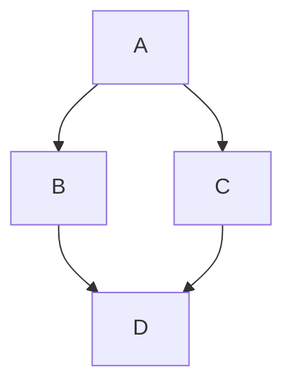

### 1.2 Nodes & Shapes

- `id` - Default box
- `id1[Text]` - Rectangle with text
- `id1(Text)` - Rounded edges
- `id1((Text))` - Circle
- `id1>Text]` - Asymmetric shape
- `id1{Text}` - Rhombus (Decision)

### 1.3 Links

- `A-->B` - Arrow head
- `A---B` - Open link
- `A-- Text ---B` - Text on link
- `A---|Text|B` - Text on link
- `A-->|Text|B` - Link with arrow and text
- `A-- Text -->B` - Link with arrow and text
- `A-.->B` - Dotted link
- `A-. Text .->B` - Dotted link with text
- `A==>B` - Thick link
- `A== Text ==>B` - Thick link with text

### 1.4 Subgraphs

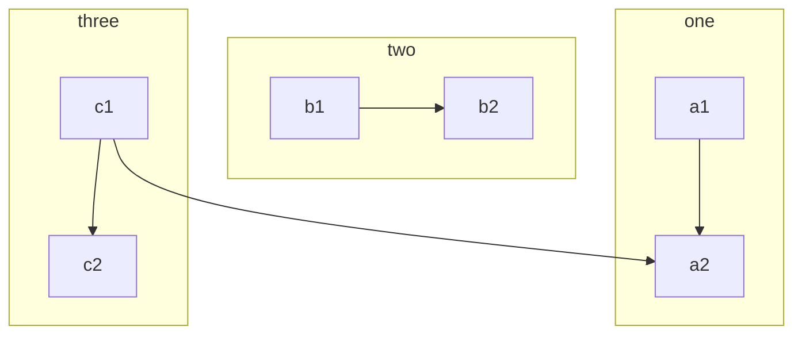

## 2. Sequence Diagrams

A Sequence diagram is an interaction diagram that shows how processes operate with one another and in what order.

### 2.1 Participants

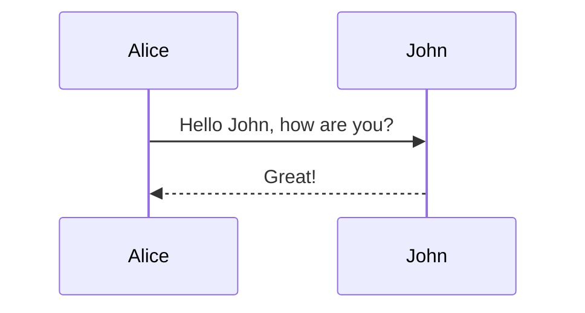

### 2.2 Aliases

### 2.3 Messages

- `->` Solid line without arrow
- `-->` Dotted line without arrow
- `->>` Solid line with arrowhead
- `-->>` Dotted line with arrowhead
- `-x` Solid line with a cross at the end (async)
- `--x` Dotted line with a cross at the end (async)

### 2.4 Activations

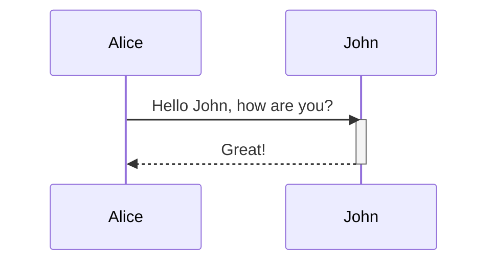

Shortcut: `Alice->>+John: Hello` and `John-->>-Alice: Great!`

### 2.5 Notes

`Note [ right of | left of | over ] [Actor]: Text`

### 2.6 Loops

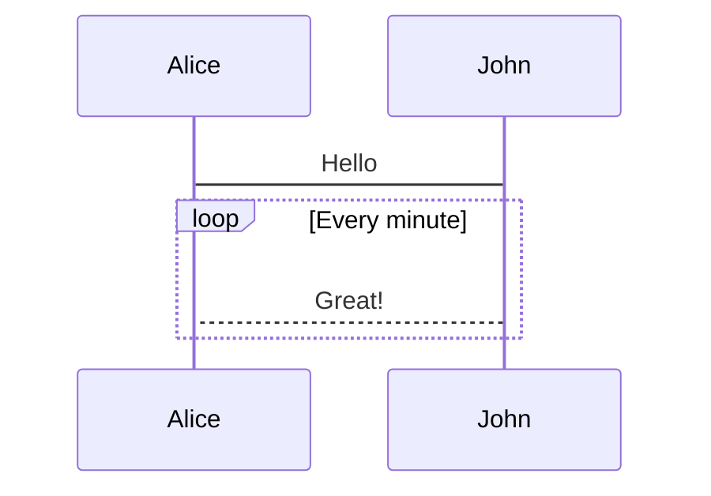

### 2.7 Alt (Alternative paths)

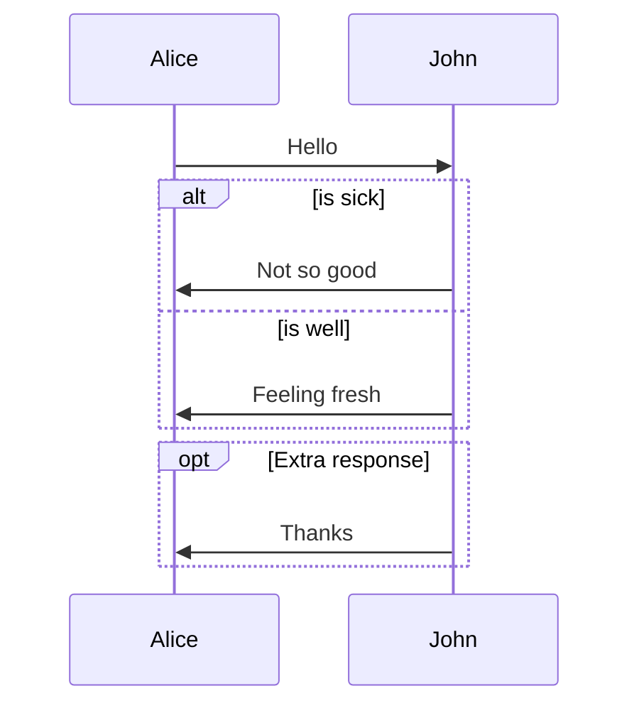

## 3. Gantt Diagrams

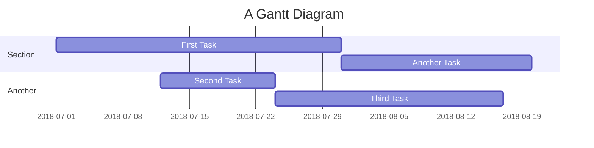

## 4. Class Diagrams

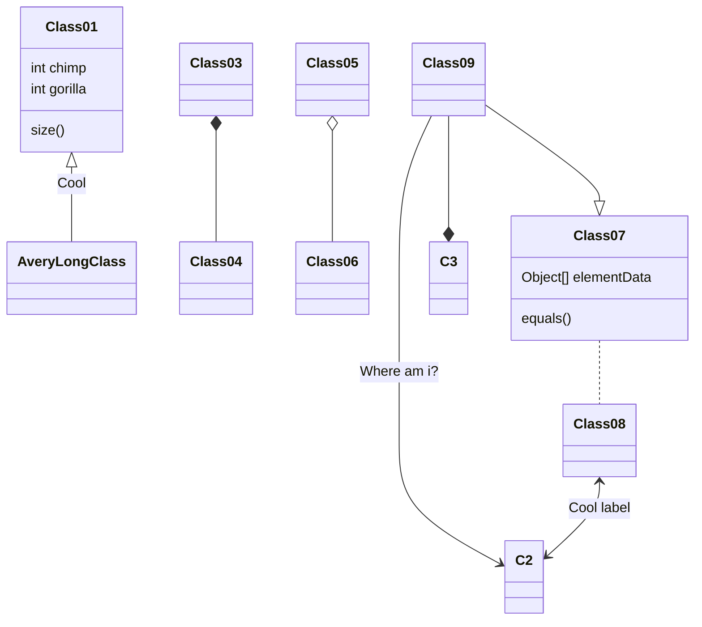

## 5. State Diagrams

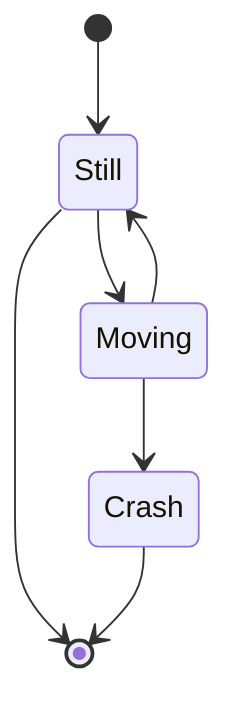

## 6. Entity Relationship Diagrams

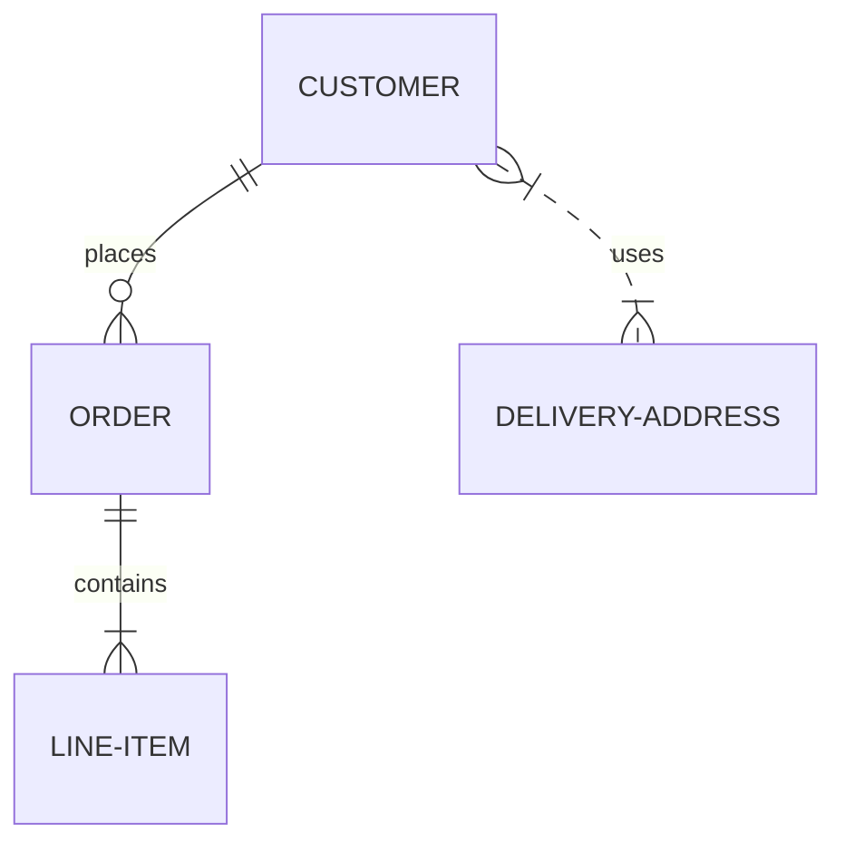

## 7. User Journey

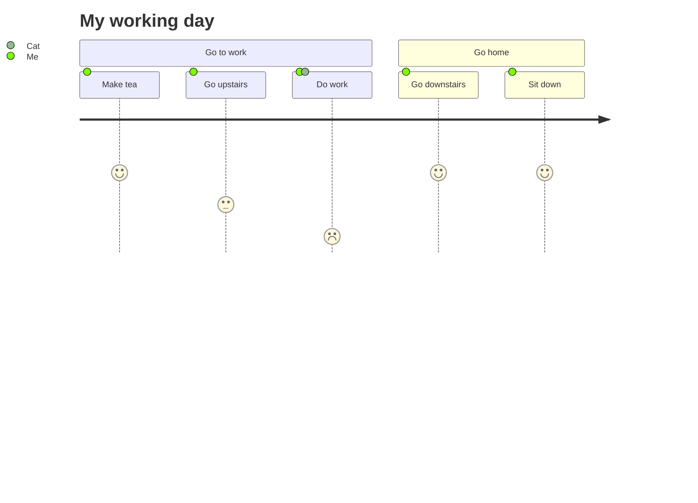

## 8. Pie Chart

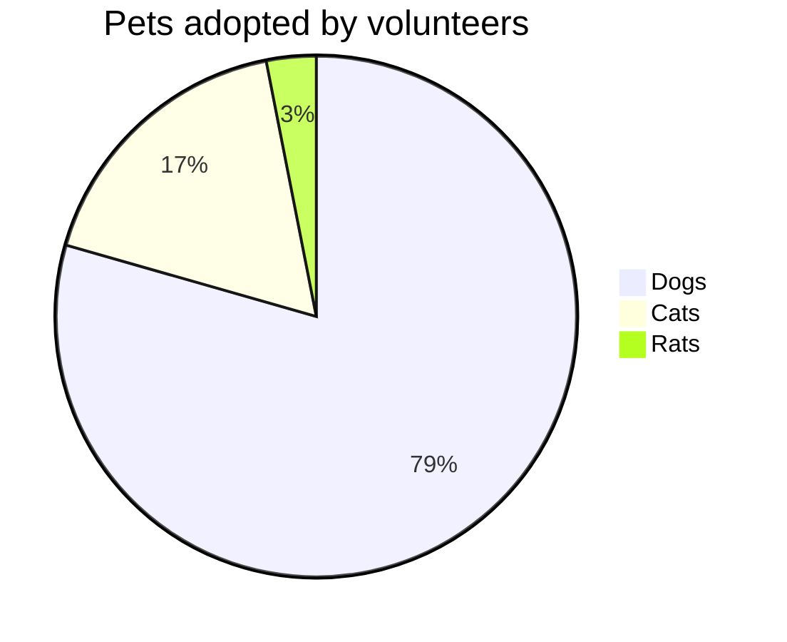
