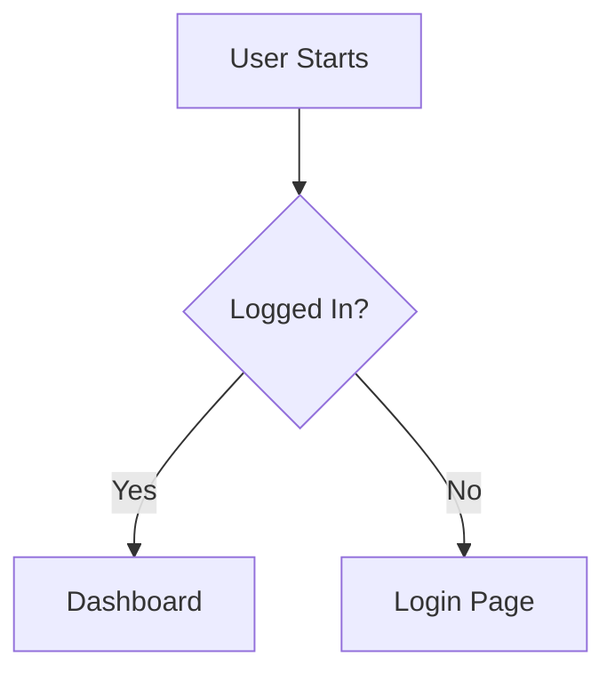

# How to Write a Product Requirements Document (PRD)

> **CRITICAL**: MUST save the final PRD to a file (e.g., `documents/prd-<slug>.md`). Do NOT only output in chat — always persist to disk.

When generating or refining a Product Requirements Document (PRD), follow these
guidelines to ensure clarity, completeness, and alignment. This rule is designed
to apply "Prompt Engineering" principles—clarity, constraints, and structure—to
documentation.

## 1. Core Principles

- **Outcome-Oriented**: Focus on the _value_ delivered to the user, not just the
  technical implementation.
- **Measurable**: Requirements must be testable. Avoid vague terms like "fast"
  or "reliable" without metrics.
- **Unambiguous**: Remove ambiguity. If a requirement can be interpreted in
  multiple ways, it is a bug in the PRD.
- **Living Document**: Acknowledge that the PRD evolves. Mark unknowns clearly.

## 2. Writing Strategy (AI Instructions)

When asked to write a PRD:

1. **Analyze the Request**: Identify the core problem, target audience, and
   business goal.
2. **Ask Clarifying Questions**: If key context is missing (e.g., "Who is this
   for?", "What are the constraints?"), ask the user before generating the full
   doc (see `flowai-skill-conduct-qa-session`).
3. **Drafting**: Use the template below.
4. **Review**: Check against the "Bad vs Good" examples in Section 4.
5. **Persist**: MUST write the final PRD to a file (e.g., `documents/prd-<slug>.md`
   or a path specified by the user). Do NOT only output the PRD in chat — always
   save it to disk using the file write tool (Write, write_to_file, etc.).

## 3. PRD Template

### [PRD] {Title} {Status: Draft/Review/Approved}

#### 1. Executive Summary

- **Problem Statement**: Clear, concise description of the user pain point or
  business opportunity.
- **Proposed Solution**: High-level overview of the feature/product.
- **Value Proposition**: Why is this important? What is the expected impact?

#### 2. Success Metrics (KPIs)

- **Primary Metric**: The one number that defines success (e.g., Conversion Rate
  +5%).
- **Guardrail Metrics**: What specific negative outcomes must we avoid? (e.g.,
  Latency < 200ms, Error rate < 1%).

#### 3. Scope & User Stories

**Target Audience**: [Persona Name] - [Short Description]

| ID   | User Story                                        | Acceptance Criteria              | Priority |
| ---- | ------------------------------------------------- | -------------------------------- | -------- |
| US-1 | As a [User], I want to [Action] so that [Benefit] | 1. Criterion A 2. Criterion B | P0       |

**Out of Scope**:

- List specific features or use cases that are explicitly excluded to prevent
  scope creep.

#### 4. Functional Requirements

- **Core Logic**: Detailed business rules (e.g., "If user is unverified,
  restrict access to X").
- **Edge Cases**: Empty states, error states, offline behavior.
- **Data Requirements**: Fields, validation rules, sources.

#### 5. Non-Functional Requirements

- **Performance**: Latency, throughput, load expectations.
- **Security**: Authentication, authorization, data privacy (GDPR/PII).
- **Compatibility**: Browsers, devices, OS versions.

#### 6. User Experience (UX)

- **Flow**: Describe the user journey (or insert Mermaid diagram).
- **UI Elements**: Key inputs, outputs, and feedback mechanisms.

#### 7. Dependencies & Risks

- **Dependencies**: APIs, other teams, third-party services.
- **Risks**: Technical challenges, compliance issues, adoption risks.
- **Mitigation**: How will we handle these risks?

#### 8. Open Questions

- List of unresolved questions that need input from stakeholders or technical
  research.

## 4. Examples: "Bad" vs "Good" Requirements

**Ambiguity vs. Specificity**

- 🔴 **Bad**: "The system should be fast."
- 🟢 **Good**: "API response time must be under 200ms for 95% of requests at a
  load of 100 QPS."

**Implementation vs. Intent**

- 🔴 **Bad**: "Add a blue button that says Save."
- 🟢 **Good**: "The user must be able to persist their changes. The action
  should be prominent and follow the primary action style guide."

**Error Handling**

- 🔴 **Bad**: "Handle errors gracefully."
- 🟢 **Good**: "If the backend is unreachable, display a toast notification with
  the message 'Connection failed, retrying...' and automatically retry 3 times
  with exponential backoff."

## 5. Visuals

Use Mermaid diagrams where possible to illustrate flows:

