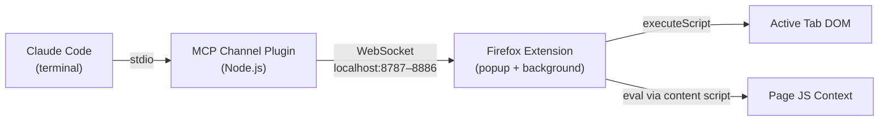
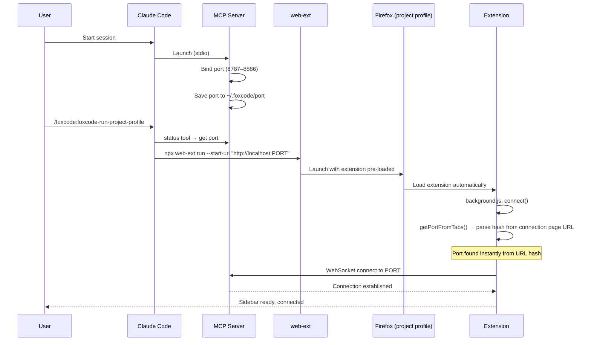
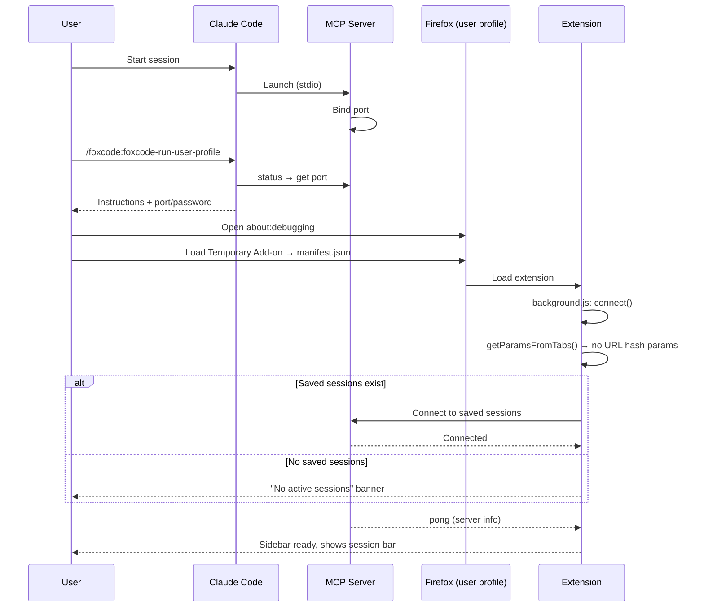

# FoxCode: Claude Code -> Firefox Bridge

> **⚠️ Active Development** - This project is under heavy development. APIs, configuration, and behavior may change without notice. Expect breaking changes between versions.

Firefox WebExtension giving Claude Code browser automation in your real browser — with your sessions, cookies, and extensions. The agent scripts multi-step scenarios in a single call instead of round-tripping per action.

FoxCode is a two-part system: a **Claude Code plugin** (MCP server on Node.js) and a **Firefox WebExtension** (popup eval console + browser automation), connected via WebSocket on localhost.

## Usage Patterns

- **Test in the browser** — verify fixes, check form flows, inspect rendered output — with access to your project's code
- **Automate browser operations** — fill forms, click through flows, extract data, manage cookies/storage in one `evalInBrowser` call
- **Debug with browser context** — inspect DOM or take a snapshot alongside the source, no need to explain what's on screen

## Getting Started

### Install

Run `/plugin` in Claude Code — it opens an interactive plugin manager. Add the marketplace `korchasa/foxcode` in the Marketplaces tab, then install `foxcode` from the Discover tab.

Or use commands directly:
```
/plugin marketplace add korchasa/foxcode
/plugin install foxcode@korchasa
```

### Launch

- `/foxcode:foxcode-run-project-profile` — isolated Firefox via web-ext with project-local profile (`.foxcode/firefox-profile/`). Self-contained: checks prerequisites, locates extension, caches paths in `.foxcode/config.json`.
- `/foxcode:foxcode-run-user-profile` — your own Firefox via about:debugging. Self-contained: checks prerequisites, locates extension, guides manual loading, caches paths in `.foxcode/config.json`.

## Features

- **Real browser, real context** — works in your Firefox with existing sessions, cookies, auth, extensions. No separate browser instance
- **Single-call scripting** — agent writes a full JS scenario (navigate → fill → click → assert) and sends it in one tool call. No round-trip per action — fewer tool calls means fewer tokens and lower API cost
- **Rich async API** — ~36 helpers for DOM, navigation, tabs, cookies, screenshots, storage, console capture, dialog handling
- **Multi-session** — multiple Claude Code sessions connect to one browser simultaneously. Each gets its own MCP server on a unique port
- **Zero setup for the agent** — Claude Code plugin installs via marketplace, MCP server auto-starts, extension auto-connects via URL hash

## Architecture



The MCP server binds to a random port in range 8787–8886 and persists it in `~/.foxcode/port`. The extension supports multiple simultaneous connections (one per CC session) — auto-connects via URL hash params, or reconnects to saved sessions. No port scanning, no manual settings.

## Components

- **Channel Plugin** (`foxcode/channel/`) - MCP server (Node.js, ES modules) bridging Claude Code -> extension via WebSocket. Installed as a Claude Code plugin, provides MCP tools
- **Firefox Extension** (`extension/`) - Manifest V2 WebExtension: popup eval console (browser_action), background script for WebSocket + code execution, content script for DOM access in page context
- **Run Project Profile Skill** (`foxcode/skills/foxcode-run-project-profile/SKILL.md`) - self-contained: prerequisites, locate extension, launch isolated Firefox via web-ext, verify connectivity
- **Run User Profile Skill** (`foxcode/skills/foxcode-run-user-profile/SKILL.md`) - self-contained: prerequisites, locate extension, guide manual loading, verify connectivity

### MCP tools provided to Claude Code

- `evalInBrowser(code, timeout?)` - execute JS with browser automation API (click, fill, navigate, snapshot, screenshot, cookies, tabs, etc.)
- `status()` - server telemetry: port, password, projectDir, uptime, connectedClients, launchMode, client info
- `ping()` - verify connectivity to browser extension

## Launch Flows

Two ways to load the extension into Firefox. Both are valid and must stay working.

### Project Profile (`/foxcode:foxcode-run-project-profile`)

Isolated Firefox instance launched via `web-ext run` with a project-local profile (`.foxcode/firefox-profile/`). Port is passed via URL hash — instant connection. First setup via `install`, subsequent launches via `run`.



### User Profile (`/foxcode:foxcode-run-user-profile`)

Extension loaded into user's own Firefox via about:debugging. No port in URL — extension uses saved sessions from previous run. Re-launch via `/foxcode:foxcode-run-user-profile`.



### Key differences

- **Project Profile**: isolated Firefox, port known upfront (URL hash) → instant connect. Persistent project-local profile
- **User Profile**: user's own Firefox, no port hint → probe saved sessions. Temporary add-on, re-load after Firefox restart
- **Multi-session**: extension supports N simultaneous WebSocket connections. Popup shows eval messages from all sessions
- **Reconnect**: per-session exponential backoff (3s → 30s max, 10 attempts). Dead sessions auto-removed
- **Connection**: both skills verify connectivity via `status` + `ping` tools

## Troubleshooting

### Popup shows "No active sessions"

The popup displays session list with connection status. Use this to identify the issue:

- **No sessions** — MCP server not running or extension hasn't connected. Check `/mcp` in Claude Code.
- **Session shows "(reconnecting…)"** — Server was running but stopped. CC may have exited. After 10 failed reconnect attempts (exponential backoff 3s → 30s) the session is silently removed from the list.
- **To connect** — open the connection URL (`http://localhost:PORT#PORT:PASSWORD`) from the skill output, or re-run the launch skill.

### evalInBrowser returns "No browser extension connected"

CC calls `evalInBrowser` but no extension has an open WebSocket to the server.

- Extension not loaded — load via `about:debugging` or re-run the launch skill.
- Connection dropped — check popup for session status. Re-open the connection URL.
- Password mismatch — if `~/.foxcode/password` was regenerated (e.g. deleted and server restarted), the extension's saved session has a stale token. Fix: re-open the connection URL (`http://localhost:PORT#PORT:PASSWORD`) from `status` tool output, or delete `~/.foxcode/password` and restart both server and extension.

### evalInBrowser timeout

Default timeout is 30s (server-side and extension-side). If code execution exceeds it, you get `Browser tool request timed out after 30000ms`.

- Pass a higher timeout: `evalInBrowser({ code: "...", timeout: 60000 })`
- Break long operations into smaller `evalInBrowser` calls.

### MCP server fails to start

1. **Port conflict.** Server binds to a port in 8787–8886. Check: `lsof -i :8787-8886 | grep node`
2. **All ports occupied.** If all 100 ports are busy, server starts without WebSocket (stderr: `no free port in range`). Free ports or use `FOXCODE_PORT`.
3. **Reset saved port:** `rm ~/.foxcode/port`
4. **Force a specific port.** Set `FOXCODE_PORT` env var in `.mcp.json`:
   ```json
   {"mcpServers": {"foxcode": {"command": "...", "env": {"FOXCODE_PORT": "8800"}}}}
   ```
5. **Check dependencies:** `cd foxcode/channel && npm install`
