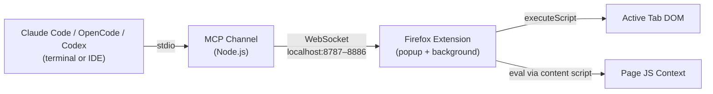
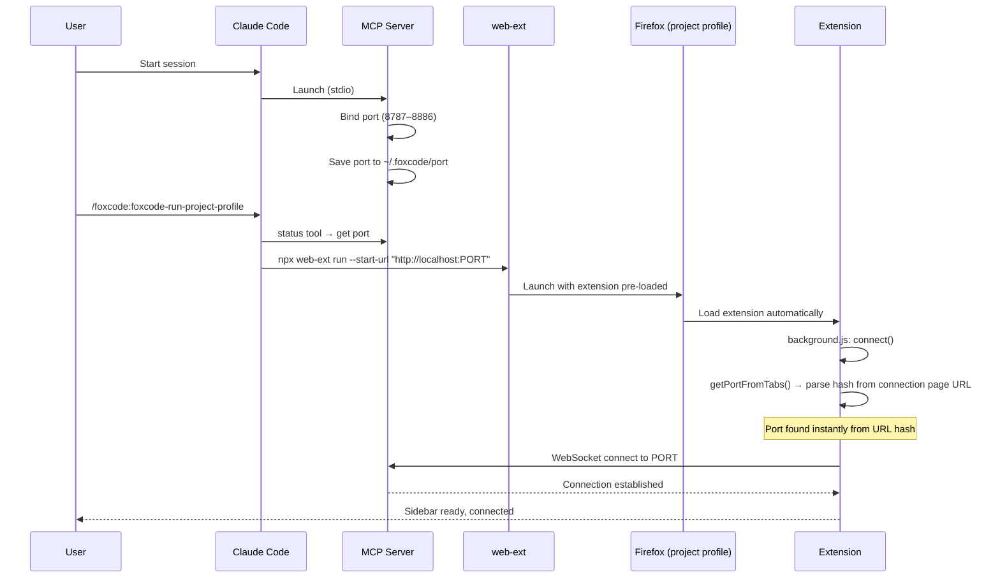
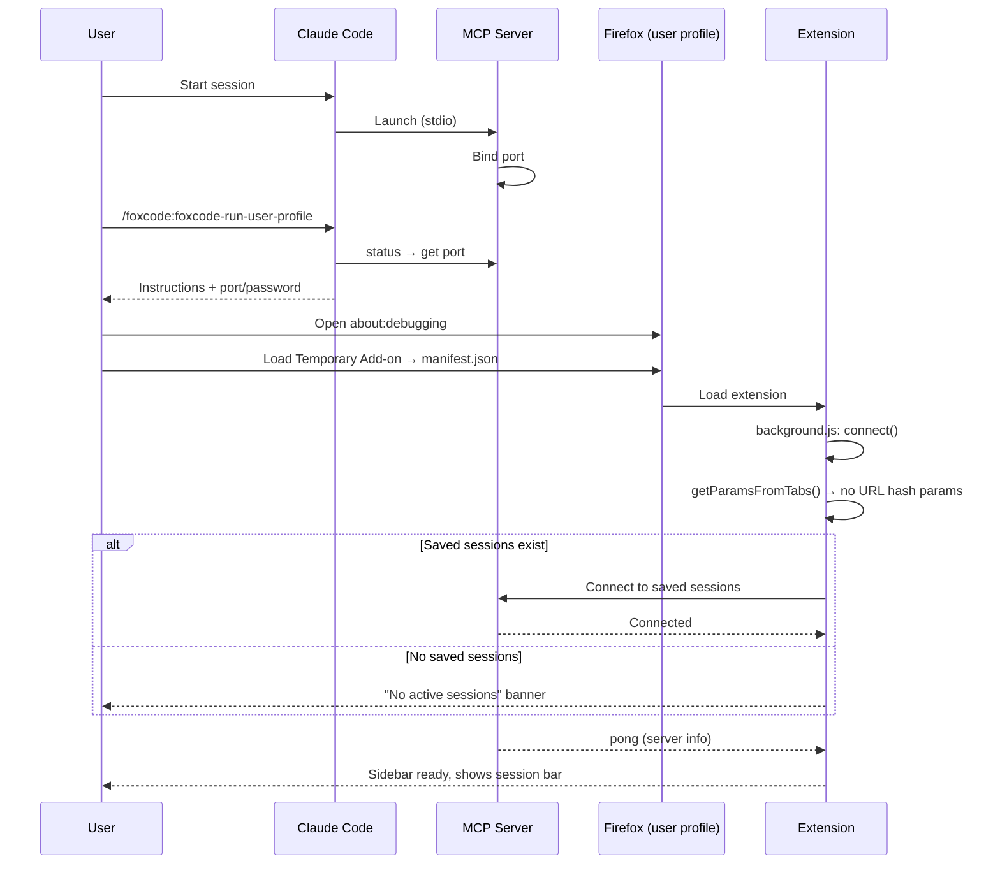

# FoxCode: AI Coding Agent -> Firefox Bridge

> **⚠️ Active Development** - This project is under heavy development. APIs, configuration, and behavior may change without notice. Expect breaking changes between versions.

Firefox WebExtension giving Claude Code, OpenCode, and Codex browser automation in your real browser — with your sessions, cookies, and extensions. The agent scripts multi-step scenarios in a single call instead of round-tripping per action.

FoxCode is a two-part system: an **MCP server** (Node.js channel launched by your agent) and a **Firefox WebExtension** (popup eval console + browser automation), connected via WebSocket on localhost.

## Usage Patterns

- **Test in the browser** — verify fixes, check form flows, inspect rendered output — with access to your project's code
- **Automate browser operations** — fill forms, click through flows, extract data, manage cookies/storage in one `evalInBrowser` call
- **Debug with browser context** — inspect DOM or take a snapshot alongside the source, no need to explain what's on screen

## Getting Started

### Install

Run `/plugin` in Claude Code — it opens an interactive plugin manager. Add the marketplace `korchasa/foxcode` in the Marketplaces tab, then install `foxcode` from the Discover tab.

Or use commands directly:
```
/plugin marketplace add korchasa/foxcode
/plugin install foxcode@korchasa
```

### Launch

- `/foxcode:foxcode-run-project-profile` — isolated Firefox via web-ext with project-local profile (`.foxcode/firefox-profile/`). Self-contained: checks prerequisites, locates extension, caches paths in `.foxcode/config.json`.
- `/foxcode:foxcode-run-user-profile` — your own Firefox via about:debugging. Self-contained: checks prerequisites, locates extension, guides manual loading, caches paths in `.foxcode/config.json`.

## Install in Any IDE

Paste the prompt below into a Claude Code, Codex, or OpenCode session. The agent detects your IDE, explains every change before making it, and installs foxcode from published sources only.

````
Install foxcode in the current AI IDE. Follow these steps exactly.

**Step 1 — Detect IDE**

Run all three checks and report results:
- `echo ${CLAUDE_PRODUCT:-unset}` — if not "unset", IDE is Claude Code
- `which codex 2>/dev/null` — if a path is returned, IDE is Codex
- `which opencode 2>/dev/null || ls ~/.config/opencode/ 2>/dev/null` — if anything is returned, IDE is OpenCode

If multiple match, pick the one you are currently running inside.
If none detected, ask the user which IDE they are using and wait for the answer.

**Step 2 — Explain the plan and ask for confirmation**

Before making any changes, tell the user:
- Which IDE was detected and why (which check matched)
- Every command that will run
- Every file that will be created or modified, and exactly what will be written
- Any known caveats or limitations for this IDE

Then ask: "Proceed with installation? yes / no" — do not continue until the user confirms.

**Step 3 — Install**

For **Claude Code**:
1. `/plugin marketplace add korchasa/foxcode`
   Registers the marketplace source from https://github.com/korchasa/foxcode.
2. `/plugin install foxcode@korchasa`
   Installs the plugin: MCP server, Firefox extension, launch skills.
3. Verify: run `/mcp` and confirm `foxcode` appears in the server list.

For **Codex**:
Background: Codex does not substitute `${CLAUDE_PLUGIN_ROOT}` in `.mcp.json` args for MCP server
processes (env vars confirmed empty at runtime; upstream issue #19372). The workaround adds a global
`[mcp_servers.foxcode]` entry whose shell command locates the cached plugin dir at startup via a
version-agnostic glob — so no config change is needed when the plugin updates.

1. `codex plugin marketplace add korchasa/foxcode`
   Downloads and caches the plugin. Installs launch skills.
2. Check `~/.codex/config.toml` for an existing `[mcp_servers.foxcode]` block.
   If it already exists, skip step 3.
3. Append this block to `~/.codex/config.toml`:

```toml
[mcp_servers.foxcode]
command = "sh"
args = [
  "-c",
  "set -e; export FOXCODE_PROJECT_DIR=\"$PWD\"; PLUGIN_DIR=$(ls -d \"$HOME/.codex/plugins/cache/korchasa/foxcode/\"*/channel 2>/dev/null | sort -V | tail -1); [ -n \"$PLUGIN_DIR\" ] || { echo 'foxcode plugin cache not found — run: codex plugin marketplace add korchasa/foxcode' >&2; exit 1; }; cd \"$PLUGIN_DIR\"; npm ci --omit=dev --silent 2>/dev/null; exec node server.mjs",
]
```

4. Verify: `grep -A5 'mcp_servers.foxcode' ~/.codex/config.toml`

For **OpenCode**:
Note: the npm package `@korchasa/foxcode-opencode` is not yet published. If the command below fails
with a 404 or "package not found" error, stop and report: "OpenCode install is not yet available
from published sources — check https://github.com/korchasa/foxcode for updates."

1. `npx -y @korchasa/foxcode-opencode setup --write-config`
   Seeds launch skills into `~/.config/opencode/skills/` and patches
   `~/.config/opencode/opencode.json` with the `mcp.foxcode` entry.
2. Verify: `npx -y @korchasa/foxcode-opencode doctor`

**Step 4 — Next steps**

Check that Firefox is installed (`which firefox` or `which firefox-esr`), then launch:
- Claude Code: `/foxcode:foxcode-run-project-profile`
- Codex: `$foxcode-run-project-profile`
- OpenCode: run the `foxcode-run-project-profile` skill
````

## Install in Codex

Two options:

### Global install (recommended)

Use the [Install in Any IDE](#install-in-any-ide) prompt above, or run manually:

```sh
codex plugin marketplace add korchasa/foxcode
```

Then append to `~/.codex/config.toml`:

```toml
[mcp_servers.foxcode]
command = "sh"
args = [
  "-c",
  "set -e; export FOXCODE_PROJECT_DIR=\"$PWD\"; PLUGIN_DIR=$(ls -d \"$HOME/.codex/plugins/cache/korchasa/foxcode/\"*/channel 2>/dev/null | sort -V | tail -1); [ -n \"$PLUGIN_DIR\" ] || { echo 'foxcode plugin cache not found — run: codex plugin marketplace add korchasa/foxcode' >&2; exit 1; }; cd \"$PLUGIN_DIR\"; npm ci --omit=dev --silent 2>/dev/null; exec node server.mjs",
]
```

The shell command locates the latest cached version via glob — no config change needed on updates.

Diagnostics:

```sh
codex mcp get foxcode      # verifies the MCP entry resolves
codex mcp list             # lists all configured MCP servers
```

> **Why the manual config patch?** `codex plugin marketplace add` caches the plugin correctly and installs its skills, but Codex does not substitute `${CLAUDE_PLUGIN_ROOT}` / `${PLUGIN_ROOT}` placeholders in `.mcp.json` args for MCP server processes, nor does it set those env vars at MCP server runtime (per Codex docs, env vars are available only to hook commands; empirically confirmed empty in MCP server env). Tracking: upstream Codex issue [#19372](https://github.com/openai/codex/issues/19372).

### Project-scoped (simpler, no global config)

Clone the repository and run Codex from inside it:

```sh
git clone https://github.com/korchasa/foxcode.git
cd foxcode
codex
```

The repo ships:

- `.codex/config.toml` — registers the `foxcode` MCP server for this project.
- `.agents/skills/foxcode-run-{project,user}-profile/` — repo-scoped Codex skills.

Inside a Codex session run one of:

- `$foxcode-run-project-profile` — isolated Firefox via `web-ext`. Project-local profile.
- `$foxcode-run-user-profile` — your own Firefox via `about:debugging`.

## Install in OpenCode

> **The npm package `@korchasa/foxcode-opencode` is not published yet.** Until then, install from a local clone:
>
> ```sh
> git clone https://github.com/korchasa/foxcode.git
> cd foxcode/opencode && npm install --omit=dev
> node bin/foxcode-opencode.mjs setup --write-config
> ```
>
> The CLI seeds launch skills into `~/.config/opencode/skills/`, writes `~/.foxcode/opencode-plugin-dir` so the launch skills can locate the bundled extension, lazily installs channel deps, and patches `opencode.json` with the `mcp.foxcode` entry. After the package is published to npm, the snippets below will work as written.

Once `@korchasa/foxcode-opencode` is on npm:

```sh
npx -y @korchasa/foxcode-opencode setup --write-config
```

Plugin route (auto-update via Bun):

```json
{ "plugin": ["@korchasa/foxcode-opencode"] }
```

Diagnostics / uninstall:

```sh
npx -y @korchasa/foxcode-opencode doctor
npx -y @korchasa/foxcode-opencode uninstall
```

Removes seeded symlinks (preserves any user-owned real directory in their place) and the handoff file. `mcp.foxcode` is **not** auto-removed from `opencode.json` — remove the entry by hand to avoid destructive config mutation.

## Features

- **Real browser, real context** — your Firefox with existing sessions, cookies, auth, extensions
- **Single-call scripting** — full JS scenario in one tool call, no round-trip per action
- **Rich async API** — ~36 helpers for DOM, navigation, tabs, cookies, screenshots, storage, console capture, dialog handling
- **Multi-session** — multiple agent sessions connect to one browser simultaneously, each on a unique port
- **Zero setup for supported paths** — Claude Code plugin, OpenCode package, or Codex project config starts the same MCP server; extension auto-connects via URL hash

## Architecture



The MCP server binds to a random port in range 8787–8886 and persists it in `~/.foxcode/port`. The extension supports multiple simultaneous connections (one per agent session) — auto-connects via URL hash params, or reconnects to saved sessions. No port scanning, no manual settings.

## Components

- **Channel** (`foxcode/channel/`) - MCP server (Node.js, ES modules) bridging agent -> extension via WebSocket. Installed or configured per supported agent, provides MCP tools
- **Firefox Extension** (`foxcode/extension/`) - Manifest V2 WebExtension bundled inside the plugin: popup eval console (browser_action), background script for WebSocket + code execution, content script for DOM access in page context
- **Run Skills** (`foxcode/skills/`) - launch skills for Project Profile and User Profile modes (see Launch)

### MCP tools provided to agents

- `evalInBrowser(code, timeout?)` - execute JS with browser automation API (click, fill, navigate, snapshot, screenshot, cookies, tabs, etc.)
- `status()` - server telemetry: port, password, projectDir, uptime, connectedClients, launchMode, client info

## Launch Flows

### Project Profile (`/foxcode:foxcode-run-project-profile`)

Isolated Firefox via `web-ext run`, project-local profile (`.foxcode/firefox-profile/`). Port passed via URL hash — instant connection.



### User Profile (`/foxcode:foxcode-run-user-profile`)

User's own Firefox via about:debugging. No port in URL — extension uses saved sessions.



### Key differences

- **Project Profile**: isolated Firefox, port known upfront (URL hash) → instant connect. Persistent project-local profile
- **User Profile**: user's own Firefox, no port hint → probe saved sessions. Temporary add-on, re-load after Firefox restart
- **Multi-session**: extension supports N simultaneous WebSocket connections. Popup shows eval messages from all sessions
- **Reconnect**: per-session exponential backoff (3s → 30s max, 10 attempts). Dead sessions auto-removed
- **Connection**: both skills verify connectivity via `status` tool (connectedClients > 0)

## Permissions

By default, Claude Code asks for approval on every `evalInBrowser` call. To reduce friction, add permission rules to `.claude/settings.json` in your project:

```json
{
  "permissions": {
    "allow": [
      "mcp__foxcode__status"
    ]
  }
}
```

This auto-approves `status` (read-only, safe). `evalInBrowser` stays in ask mode — it executes arbitrary JS in your browser, so manual approval per call is recommended.

To also auto-approve `evalInBrowser` (use with caution):
```json
{
  "permissions": {
    "allow": [
      "mcp__foxcode__status",
      "mcp__foxcode__evalInBrowser"
    ]
  }
}
```

## Troubleshooting

### Popup shows "No active sessions"

- **No sessions** — MCP server not running or extension hasn't connected. Check `/mcp` in Claude Code.
- **Session shows "(reconnecting…)"** — Server was running but stopped. CC may have exited. After 10 failed reconnect attempts (exponential backoff 3s → 30s) the session is silently removed from the list.
- **To connect** — open the connection URL (`http://localhost:PORT#PORT:PASSWORD`) from the skill output, or re-run the launch skill.

### evalInBrowser returns "No browser extension connected"

- Extension not loaded — load via `about:debugging` or re-run the launch skill.
- Connection dropped — check popup for session status. Re-open the connection URL.
- Password mismatch — if `~/.foxcode/password` was regenerated (e.g. deleted and server restarted), the extension's saved session has a stale token. Fix: re-open the connection URL (`http://localhost:PORT#PORT:PASSWORD`) from `status` tool output, or delete `~/.foxcode/password` and restart both server and extension.

### evalInBrowser timeout

Default timeout is 30s. If exceeded: `Browser tool request timed out after 30000ms`.

- Pass a higher timeout: `evalInBrowser({ code: "...", timeout: 60000 })`
- Break long operations into smaller `evalInBrowser` calls.

### MCP server fails to start

1. **Port conflict.** Server binds to a port in 8787–8886. Check: `lsof -i :8787-8886 | grep node`
2. **All ports occupied.** If all 100 ports are busy, server starts without WebSocket (stderr: `no free port in range`). Free ports or use `FOXCODE_PORT`.
3. **Reset saved port:** `rm ~/.foxcode/port`
4. **Force a specific port.** Set `FOXCODE_PORT` env var in `.mcp.json`:
   ```json
   {"mcpServers": {"foxcode": {"command": "...", "env": {"FOXCODE_PORT": "8800"}}}}
   ```
5. **Check dependencies:** `cd foxcode/channel && npm install`
