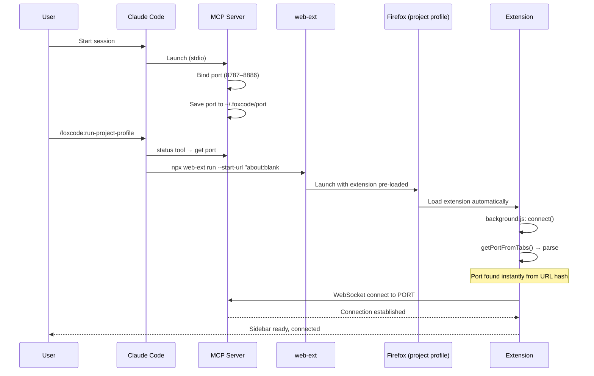
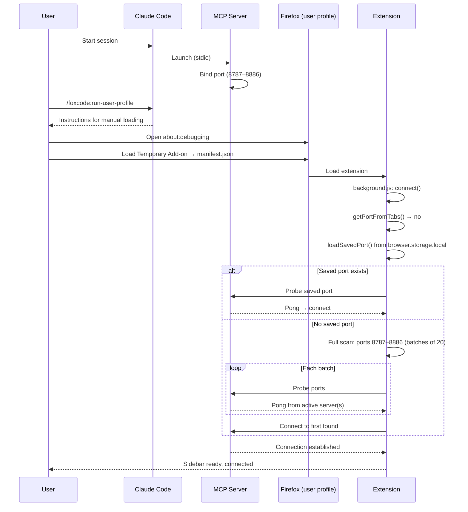

# FoxCode - Claude Code <-> Firefox Bridge

> **⚠️ Active Development** - This project is under heavy development. APIs, configuration, and behavior may change without notice. Expect breaking changes between versions.

Bidirectional bridge between Claude Code and Firefox. Chat with Claude Code from the browser sidebar, give it page context, and let it automate the browser - all without leaving Firefox.

FoxCode is a two-part system: a **Claude Code plugin** (MCP channel server on Node.js) and a **Firefox WebExtension** (sidebar UI + browser automation), connected via WebSocket on localhost.

## What it does

- **Chat in sidebar** - send/receive messages to your Claude Code session without switching to the terminal
- **Page context** - Claude Code sees the current tab URL and title with every message from the browser
- **Browser automation** - Claude Code controls the browser via `evalInBrowser`: click, fill forms, navigate, take screenshots, read DOM (~30 API helpers)
- **Multi-session support** - multiple Claude Code sessions can run FoxCode simultaneously; the extension discovers and switches between them

## Getting Started

Install plugin:
```bash
/plugin marketplace add korchasa/foxcode
/plugin install foxcode@korchasa
```

Launch FoxCode with one of two modes:
```bash
/foxcode:run-project-profile   # isolated Firefox with project-local profile
/foxcode:run-user-profile      # load extension into your own Firefox
```

### Commands

- `/foxcode:run-project-profile` — launch in isolated Firefox via web-ext with project-local profile (`.foxcode/firefox-profile/`). Self-contained: checks prerequisites, locates extension, caches paths in `.foxcode/config.json`.
- `/foxcode:run-user-profile` — load extension into your own Firefox via about:debugging. Self-contained: checks prerequisites, locates extension, guides manual loading, caches paths in `.foxcode/config.json`.

## Architecture

```
┌─────────────┐    WebSocket     ┌───────────────────┐    stdio    ┌─────────────┐
│   Firefox    │ ←────────────->  │  MCP Channel      │ ←────────-> │ Claude Code  │
│  Extension   │   localhost:    │  Plugin (Node.js)  │            │   (terminal) │
│  (sidebar +  │   8787–8886    │  foxcode/channel/  │            │              │
│  background) │                │                    │            │              │
└─────────────┘                 └───────────────────┘            └─────────────┘
```

The MCP server binds to a random port in range 8787–8886 and persists it in `~/.foxcode/port`. The extension scans the full range to discover running servers.

## Components

- **Channel Plugin** (`foxcode/channel/`) - MCP server (Node.js, ES modules) bridging Claude Code ↔ extension via WebSocket. Installed as a Claude Code plugin, provides MCP tools and the channel capability
- **Firefox Extension** (`extension/`) - Manifest V2 WebExtension: sidebar chat UI, background script for WebSocket + code execution, content script for DOM access in page context
- **Run Project Profile Skill** (`foxcode/skills/run-project-profile/SKILL.md`) - self-contained: prerequisites, locate extension, launch isolated Firefox via web-ext, verify connectivity
- **Run User Profile Skill** (`foxcode/skills/run-user-profile/SKILL.md`) - self-contained: prerequisites, locate extension, guide manual loading, verify connectivity

### MCP tools provided to Claude Code

- `reply(text)` - send a message to the browser sidebar
- `evalInBrowser(code)` - execute JS with browser automation API (click, fill, navigate, snapshot, screenshot, cookies, tabs, etc.)
- `status()` - check connection status and active tab info
- `ping()` - verify extension connectivity

## Launch Flows

Two ways to load the extension into Firefox. Both are valid and must stay working.

### Project Profile (`/foxcode:run-project-profile`)

Isolated Firefox instance launched via `web-ext run` with a project-local profile (`.foxcode/firefox-profile/`). Port is passed via URL hash — instant connection. First setup via `install`, subsequent launches via `run`.



### User Profile (`/foxcode:run-user-profile`)

Extension loaded into user's own Firefox via about:debugging. No port in URL — extension falls back to saved port or full range scan. Re-launch via `/foxcode:run-user-profile`.



### Key differences

- **Project Profile**: isolated Firefox, port known upfront (URL hash) → zero scan, instant connect. Persistent project-local profile. Re-launch via `/foxcode:run-project-profile`
- **User Profile**: user's own Firefox, no port hint → probe saved port → full range scan (up to ~7s). Temporary add-on, re-load after Firefox restart
- **Reconnect**: both flows use the same reconnect logic (saved port → full scan) with exponential backoff

## Troubleshooting

### Extension shows "No servers found"

1. **Check MCP server is running.** In Claude Code, run `/mcp` - foxcode should appear with status `✔ connected`.
2. **Check port availability.** The server binds to a port in 8787–8886. Verify it's listening:
   ```bash
   lsof -i :8787-8886 | grep node
   ```
3. **Reload the extension.** After updating FoxCode, reload in `about:debugging` -> This Firefox -> FoxCode -> Reload.

### MCP server fails to start (status: ✘ failed)

1. **Port conflict.** If another process occupies the entire range, the server can't bind. Check:
   ```bash
   lsof -i :8787-8886
   ```
   Kill stale foxcode processes if needed: `kill <PID>`.
2. **Reset saved port.** The server remembers its last port in `~/.foxcode/port`. Remove it to pick a new random port:
   ```bash
   rm ~/.foxcode/port
   ```
3. **Force a specific port.** Set `FOXCODE_PORT` env var in `.mcp.json`:
   ```json
   {"mcpServers": {"foxcode": {"command": "...", "env": {"FOXCODE_PORT": "8800"}}}}
   ```
4. **Check dependencies.** Ensure channel deps are installed:
   ```bash
   cd foxcode/channel && npm install
   ```

### Extension connected but wrong project

When multiple Claude Code sessions use FoxCode simultaneously, the extension shows a server indicator in the sidebar header. Click it to open the server picker and switch to the correct session. Use the ↻ button to rescan for servers.

### Channel capability not loaded

If MCP tools appear in `/mcp` but Claude doesn't receive browser messages, ensure the channel flag is set:
```bash
claude --dangerously-load-development-channels plugin:foxcode@korchasa
```
For dev mode with `.mcp.json`:
```bash
claude --mcp-config .mcp.json --dangerously-load-development-channels server:foxcode
```
