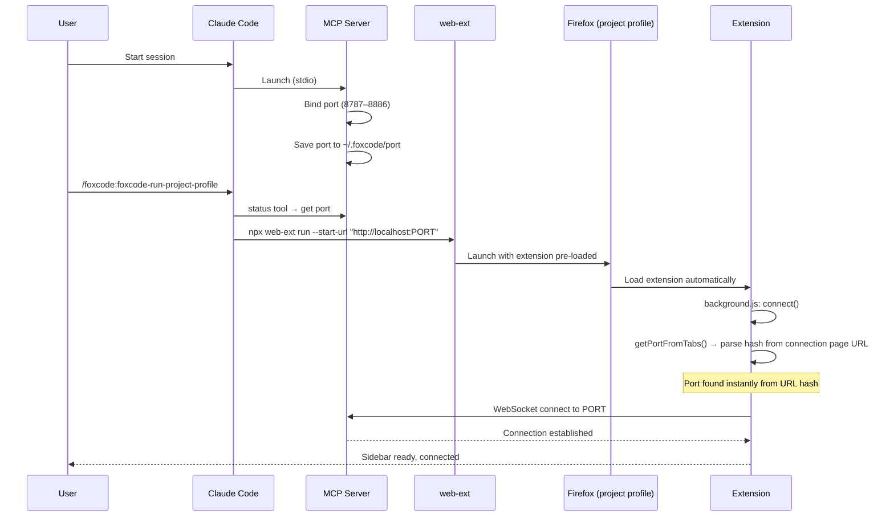
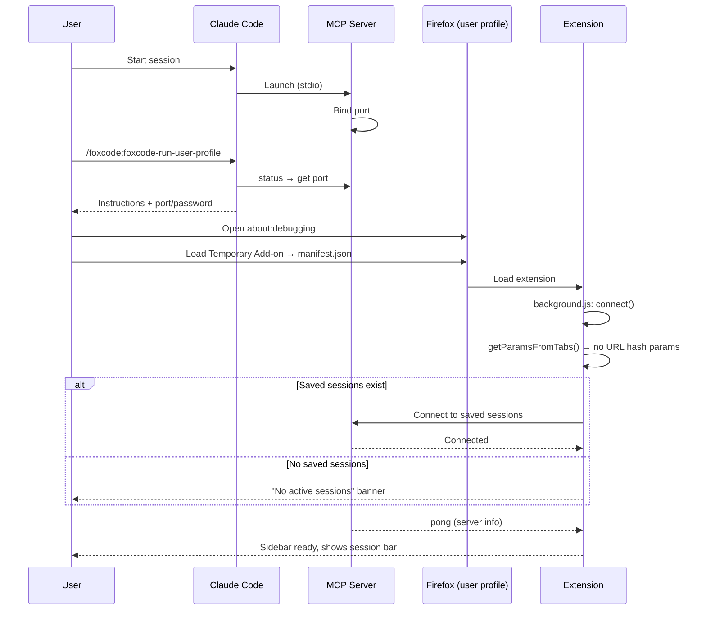

# FoxCode - Claude Code -> Firefox Bridge

> **⚠️ Active Development** - This project is under heavy development. APIs, configuration, and behavior may change without notice. Expect breaking changes between versions.

Claude Code to Firefox bridge. See Claude Code messages in the browser sidebar, give it page context, and let it automate the browser - all without leaving Firefox.

FoxCode is a two-part system: a **Claude Code plugin** (MCP server on Node.js) and a **Firefox WebExtension** (sidebar UI + browser automation), connected via WebSocket on localhost.

## Usage Patterns

### Let Claude Code test your project in the browser

Claude Code can click, fill forms, navigate, take screenshots, read DOM via `evalInBrowser` (~30 API helpers). Ask it to verify a fix, check a form flow, or inspect the rendered output — all while it has access to your project's code.

### Give Claude Code browser context for debugging

Claude Code sees the current page automatically. Useful when describing frontend issues: instead of explaining what's on screen, just point Claude Code at the page and let it inspect the DOM or take a snapshot alongside the project source.

## Getting Started

Install plugin:
```bash
/plugin marketplace add korchasa/foxcode
/plugin install foxcode@korchasa
```

Launch FoxCode with one of two modes:
```bash
/foxcode:foxcode-run-project-profile   # isolated Firefox with project-local profile
/foxcode:foxcode-run-user-profile      # load extension into your own Firefox
```

### Commands

- `/foxcode:foxcode-run-project-profile` — launch in isolated Firefox via web-ext with project-local profile (`.foxcode/firefox-profile/`). Self-contained: checks prerequisites, locates extension, caches paths in `.foxcode/config.json`.
- `/foxcode:foxcode-run-user-profile` — load extension into your own Firefox via about:debugging. Self-contained: checks prerequisites, locates extension, guides manual loading, caches paths in `.foxcode/config.json`.

## Features

- **Message display** - see Claude Code replies, tool executions, and results in the browser sidebar
- **Browser automation** - click, fill forms, navigate, take screenshots, read DOM (~30 API helpers)
- **Connection diagnostics** - sidebar shows port, params source, error details, and retry timer when disconnected

## Architecture

```
┌─────────────┐    WebSocket     ┌───────────────────┐    stdio    ┌─────────────┐
│   Firefox    │ ←────────────->  │  MCP Channel      │ ←────────-> │ Claude Code  │
│  Extension   │   localhost:    │  Plugin (Node.js)  │            │   (terminal) │
│  (sidebar +  │   8787–8886    │  foxcode/channel/  │            │              │
│  background) │                │                    │            │              │
└─────────────┘                 └───────────────────┘            └─────────────┘
```

The MCP server binds to a random port in range 8787–8886 and persists it in `~/.foxcode/port`. The extension supports multiple simultaneous connections (one per CC session) — auto-connects via URL hash params, or reconnects to saved sessions. No port scanning, no manual settings.

## Components

- **Channel Plugin** (`foxcode/channel/`) - MCP server (Node.js, ES modules) bridging Claude Code -> extension via WebSocket. Installed as a Claude Code plugin, provides MCP tools
- **Firefox Extension** (`extension/`) - Manifest V2 WebExtension: sidebar chat UI, background script for WebSocket + code execution, content script for DOM access in page context
- **Run Project Profile Skill** (`foxcode/skills/foxcode-run-project-profile/SKILL.md`) - self-contained: prerequisites, locate extension, launch isolated Firefox via web-ext, verify connectivity
- **Run User Profile Skill** (`foxcode/skills/foxcode-run-user-profile/SKILL.md`) - self-contained: prerequisites, locate extension, guide manual loading, verify connectivity

### MCP tools provided to Claude Code

- `reply(text)` - send a message to the browser sidebar
- `evalInBrowser(code)` - execute JS with browser automation API (click, fill, navigate, snapshot, screenshot, cookies, tabs, etc.)
- `status()` - server telemetry: port, uptime, clients, launchMode, client info
- `ping()` - verify connectivity to browser extension

## Launch Flows

Two ways to load the extension into Firefox. Both are valid and must stay working.

### Project Profile (`/foxcode:foxcode-run-project-profile`)

Isolated Firefox instance launched via `web-ext run` with a project-local profile (`.foxcode/firefox-profile/`). Port is passed via URL hash — instant connection. First setup via `install`, subsequent launches via `run`.



### User Profile (`/foxcode:foxcode-run-user-profile`)

Extension loaded into user's own Firefox via about:debugging. No port in URL — extension uses saved sessions from previous run. Re-launch via `/foxcode:foxcode-run-user-profile`.



### Key differences

- **Project Profile**: isolated Firefox, port known upfront (URL hash) → instant connect. Persistent project-local profile
- **User Profile**: user's own Firefox, no port hint → probe saved sessions. Temporary add-on, re-load after Firefox restart
- **Multi-session**: extension supports N simultaneous WebSocket connections. Sidebar groups messages by session with color coding
- **Reconnect**: per-session exponential backoff (3s → 30s max, 10 attempts). Dead sessions auto-removed
- **Connection**: both skills verify connectivity via `status` + `ping` tools

## Troubleshooting

### Sidebar shows "No connection" with diagnostics

The sidebar displays diagnostic info: port, params source, error, and retry timer. Use this to identify the issue:

- **Error: "Cannot connect to ws://127.0.0.1:PORT"** — MCP server not running or wrong port. Check `/mcp` in Claude Code.
- **Error: "Connection refused or dropped"** — Server was running but stopped. CC may have exited.
- **Source: "URL hash params"** — Port came from launch URL (project profile mode). If wrong, re-run `/foxcode:foxcode-run-project-profile`.
- **Source: "saved from previous session"** — Using stale port. Click the connection indicator → enter correct port/password manually.

### MCP server fails to start

1. **Port conflict.** Server binds to a port in 8787–8886. Check: `lsof -i :8787-8886 | grep node`
2. **Reset saved port:** `rm ~/.foxcode/port`
3. **Force a specific port.** Set `FOXCODE_PORT` env var in `.mcp.json`:
   ```json
   {"mcpServers": {"foxcode": {"command": "...", "env": {"FOXCODE_PORT": "8800"}}}}
   ```
4. **Check dependencies:** `cd foxcode/channel && npm install`
