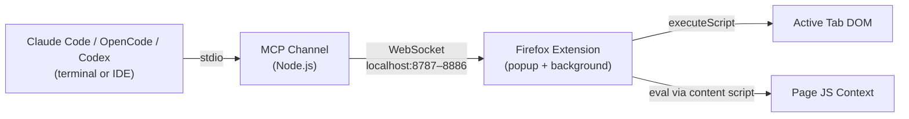
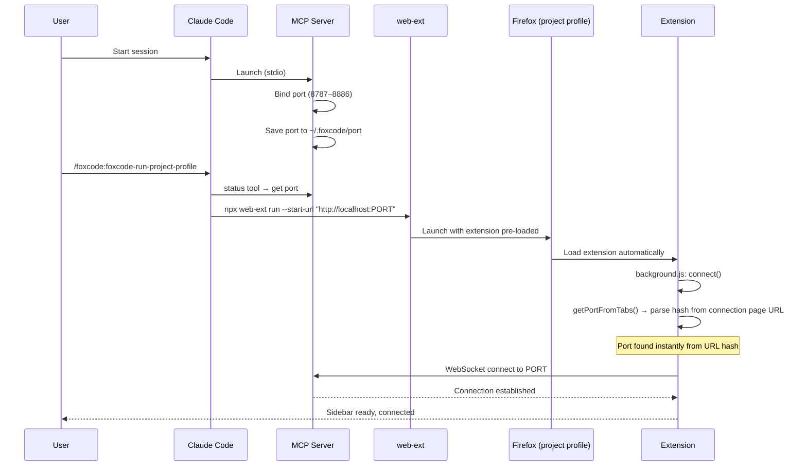
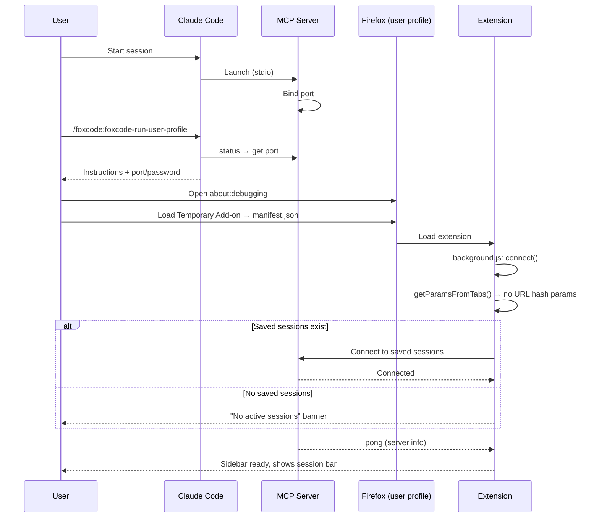

# FoxCode: AI Coding Agent -> Firefox Bridge

> **⚠️ Active Development** - This project is under heavy development. APIs, configuration, and behavior may change without notice. Expect breaking changes between versions.

Firefox WebExtension giving Claude Code, OpenCode, and Codex browser automation in your real browser — with your sessions, cookies, and extensions. The agent scripts multi-step scenarios in a single call instead of round-tripping per action.

FoxCode is a two-part system: an **MCP server** (Node.js channel launched by your agent) and a **Firefox WebExtension** (popup eval console + browser automation), connected via WebSocket on localhost.

## Usage Patterns

- **Test in the browser** — verify fixes, check form flows, inspect rendered output — with access to your project's code
- **Automate browser operations** — fill forms, click through flows, extract data, manage cookies/storage in one `evalInBrowser` call
- **Debug with browser context** — inspect DOM or take a snapshot alongside the source, no need to explain what's on screen

## Getting Started

### Install

Run `/plugin` in Claude Code — it opens an interactive plugin manager. Add the marketplace `korchasa/foxcode` in the Marketplaces tab, then install `foxcode` from the Discover tab.

Or use commands directly:
```
/plugin marketplace add korchasa/foxcode
/plugin install foxcode@korchasa
```

### Launch

- `/foxcode:foxcode-run-project-profile` — isolated Firefox via web-ext with project-local profile (`.foxcode/firefox-profile/`). Self-contained: checks prerequisites, locates extension, caches paths in `.foxcode/config.json`.
- `/foxcode:foxcode-run-user-profile` — your own Firefox via about:debugging. Self-contained: checks prerequisites, locates extension, guides manual loading, caches paths in `.foxcode/config.json`.

## Use in Codex

FoxCode ships repo-scoped Codex support:

- `.codex/config.toml` registers the `foxcode` MCP server for this project.
- `.agents/skills/foxcode-run-project-profile` and `.agents/skills/foxcode-run-user-profile` expose the launch workflows to Codex.

From the repository root, start Codex:

```sh
codex
```

Then run one of the Codex skills:

- `$foxcode-run-project-profile` — isolated Firefox via web-ext.
- `$foxcode-run-user-profile` — your own Firefox via about:debugging.

Diagnostic commands:

```sh
codex mcp get foxcode
codex mcp list
```

Codex plugin marketplace packaging is not published yet; the supported path is project-scoped config plus repo-scoped skills.

## Install in OpenCode

FoxCode also ships as an OpenCode plugin via npm. Two routes:

### One-shot CLI (recommended — single restart)

```sh
npx -y @korchasa/foxcode-opencode setup --write-config
```

The CLI seeds `foxcode-run-project-profile` and `foxcode-run-user-profile` skills into `~/.config/opencode/skills/` (as symlinks to the bundled SKILL.md), writes `~/.foxcode/opencode-plugin-dir` so the launch skills can locate the bundled extension, lazily installs channel deps, and patches `opencode.json` with the `mcp.foxcode` entry. Restart OpenCode once and run `/foxcode-run-project-profile`.

`--write-config` requires plain JSON — the CLI refuses files containing `//` or `/*` comments and prints the snippet for manual paste instead.

### Plugin route (auto-update via Bun)

Add to `opencode.json`:

```json
{ "plugin": ["@korchasa/foxcode-opencode"] }
```

OpenCode auto-installs the package via Bun on next start. The plugin runs on `session.created`, performs the same seed + handoff steps, and prints the MCP-entry snippet to stderr if `mcp.foxcode` is missing. Paste the snippet into `opencode.json` and restart OpenCode (two restarts total — the trade-off for unattended updates afterwards).

### Diagnostics

```sh
npx -y @korchasa/foxcode-opencode doctor
```

Prints prereq check, plugin/bundle paths, handoff state, and `mcp.foxcode` presence.

### Uninstall

```sh
npx -y @korchasa/foxcode-opencode uninstall
```

Removes seeded symlinks (preserves any user-owned real directory it found in their place) and the handoff file. `mcp.foxcode` is **not** auto-removed from `opencode.json` — remove the entry by hand to avoid destructive config mutation.

## Features

- **Real browser, real context** — your Firefox with existing sessions, cookies, auth, extensions
- **Single-call scripting** — full JS scenario in one tool call, no round-trip per action
- **Rich async API** — ~36 helpers for DOM, navigation, tabs, cookies, screenshots, storage, console capture, dialog handling
- **Multi-session** — multiple agent sessions connect to one browser simultaneously, each on a unique port
- **Zero setup for supported paths** — Claude Code plugin, OpenCode package, or Codex project config starts the same MCP server; extension auto-connects via URL hash

## Architecture



The MCP server binds to a random port in range 8787–8886 and persists it in `~/.foxcode/port`. The extension supports multiple simultaneous connections (one per agent session) — auto-connects via URL hash params, or reconnects to saved sessions. No port scanning, no manual settings.

## Components

- **Channel** (`foxcode/channel/`) - MCP server (Node.js, ES modules) bridging agent -> extension via WebSocket. Installed or configured per supported agent, provides MCP tools
- **Firefox Extension** (`extension/`) - Manifest V2 WebExtension: popup eval console (browser_action), background script for WebSocket + code execution, content script for DOM access in page context
- **Run Skills** (`foxcode/skills/`) - launch skills for Project Profile and User Profile modes (see Launch)

### MCP tools provided to agents

- `evalInBrowser(code, timeout?)` - execute JS with browser automation API (click, fill, navigate, snapshot, screenshot, cookies, tabs, etc.)
- `status()` - server telemetry: port, password, projectDir, uptime, connectedClients, launchMode, client info

## Launch Flows

### Project Profile (`/foxcode:foxcode-run-project-profile`)

Isolated Firefox via `web-ext run`, project-local profile (`.foxcode/firefox-profile/`). Port passed via URL hash — instant connection.



### User Profile (`/foxcode:foxcode-run-user-profile`)

User's own Firefox via about:debugging. No port in URL — extension uses saved sessions.



### Key differences

- **Project Profile**: isolated Firefox, port known upfront (URL hash) → instant connect. Persistent project-local profile
- **User Profile**: user's own Firefox, no port hint → probe saved sessions. Temporary add-on, re-load after Firefox restart
- **Multi-session**: extension supports N simultaneous WebSocket connections. Popup shows eval messages from all sessions
- **Reconnect**: per-session exponential backoff (3s → 30s max, 10 attempts). Dead sessions auto-removed
- **Connection**: both skills verify connectivity via `status` tool (connectedClients > 0)

## Permissions

By default, Claude Code asks for approval on every `evalInBrowser` call. To reduce friction, add permission rules to `.claude/settings.json` in your project:

```json
{
  "permissions": {
    "allow": [
      "mcp__foxcode__status"
    ]
  }
}
```

This auto-approves `status` (read-only, safe). `evalInBrowser` stays in ask mode — it executes arbitrary JS in your browser, so manual approval per call is recommended.

To also auto-approve `evalInBrowser` (use with caution):
```json
{
  "permissions": {
    "allow": [
      "mcp__foxcode__status",
      "mcp__foxcode__evalInBrowser"
    ]
  }
}
```

## Troubleshooting

### Popup shows "No active sessions"

- **No sessions** — MCP server not running or extension hasn't connected. Check `/mcp` in Claude Code.
- **Session shows "(reconnecting…)"** — Server was running but stopped. CC may have exited. After 10 failed reconnect attempts (exponential backoff 3s → 30s) the session is silently removed from the list.
- **To connect** — open the connection URL (`http://localhost:PORT#PORT:PASSWORD`) from the skill output, or re-run the launch skill.

### evalInBrowser returns "No browser extension connected"

- Extension not loaded — load via `about:debugging` or re-run the launch skill.
- Connection dropped — check popup for session status. Re-open the connection URL.
- Password mismatch — if `~/.foxcode/password` was regenerated (e.g. deleted and server restarted), the extension's saved session has a stale token. Fix: re-open the connection URL (`http://localhost:PORT#PORT:PASSWORD`) from `status` tool output, or delete `~/.foxcode/password` and restart both server and extension.

### evalInBrowser timeout

Default timeout is 30s. If exceeded: `Browser tool request timed out after 30000ms`.

- Pass a higher timeout: `evalInBrowser({ code: "...", timeout: 60000 })`
- Break long operations into smaller `evalInBrowser` calls.

### MCP server fails to start

1. **Port conflict.** Server binds to a port in 8787–8886. Check: `lsof -i :8787-8886 | grep node`
2. **All ports occupied.** If all 100 ports are busy, server starts without WebSocket (stderr: `no free port in range`). Free ports or use `FOXCODE_PORT`.
3. **Reset saved port:** `rm ~/.foxcode/port`
4. **Force a specific port.** Set `FOXCODE_PORT` env var in `.mcp.json`:
   ```json
   {"mcpServers": {"foxcode": {"command": "...", "env": {"FOXCODE_PORT": "8800"}}}}
   ```
5. **Check dependencies:** `cd foxcode/channel && npm install`
