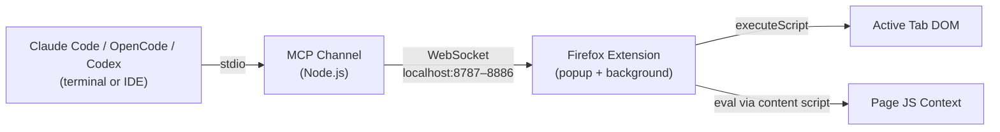
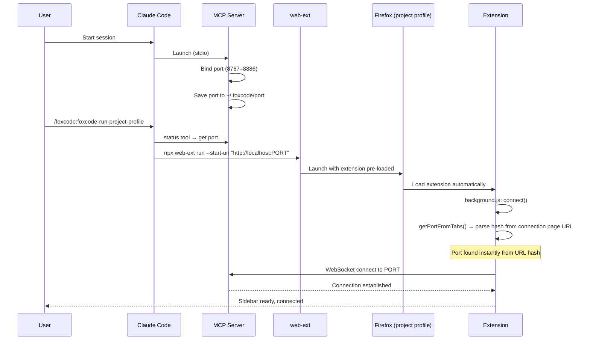
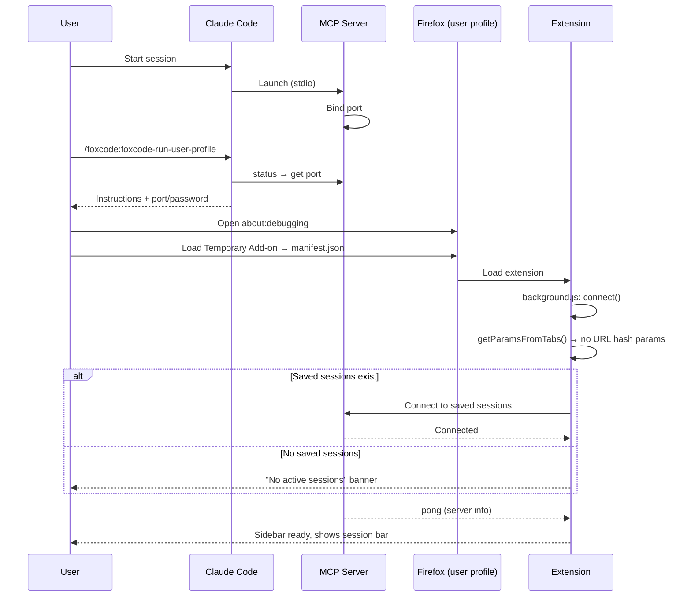

# FoxCode: AI Coding Agent -> Firefox Bridge

> **⚠️ Active Development** - This project is under heavy development. APIs, configuration, and behavior may change without notice. Expect breaking changes between versions.

Firefox WebExtension giving Claude Code, Codex, and OpenCode browser automation in your real browser — with your sessions, cookies, and extensions. The agent scripts multi-step scenarios in a single call instead of round-tripping per action.

FoxCode is a two-part system: an **MCP server** (Node.js channel launched by your agent) and a **Firefox WebExtension** (popup eval console + browser automation), connected via WebSocket on localhost.

## Usage Patterns

- **Test in the browser** — verify fixes, check form flows, inspect rendered output — with access to your project's code
- **Automate browser operations** — fill forms, click through flows, extract data, manage cookies/storage in one `evalInBrowser` call
- **Debug with browser context** — inspect DOM or take a snapshot alongside the source, no need to explain what's on screen

## Prerequisites

- Firefox (any recent version). On Linux, `firefox-esr` works too.
- Node.js ≥ 18 (the MCP channel runs on it; `node -v` to check).
- One of: Claude Code, Codex, or OpenCode CLI installed.

## Install in Claude Code

Native plugin install — fully supported. Installs the launch skills and registers the MCP server entry; the channel and Firefox extension are pulled from npm via `npx` on first launch.

```
/plugin marketplace add korchasa/foxcode
/plugin install foxcode@korchasa
```

Or run `/plugin` for an interactive picker: add the `korchasa/foxcode` marketplace, then install `foxcode`. Verify with `/mcp` — `foxcode` appears in the server list.

## Install in Codex

Native plugin install, then a one-time MCP-server config patch.

```sh
codex plugin marketplace add korchasa/foxcode
```

Then append to `~/.codex/config.toml`:

```toml
[mcp_servers.foxcode]
command = "npx"
args = ["-y", "foxcode-channel@0.22.1"]
```

Verify with `codex mcp get foxcode` and `codex mcp list`. The channel is resolved on first launch from npm and cached by npx; no glob over `~/.codex/plugins/cache/...` is needed.

> **Why a separate `[mcp_servers]` block?** `codex plugin marketplace add` caches the plugin assets (skills + Firefox extension), but Codex does not currently start MCP server processes declared in a plugin's `.mcp.json` (upstream Codex issue [#19372](https://github.com/openai/codex/issues/19372)). Declaring the entry in `~/.codex/config.toml` is the supported way to run a per-plugin MCP server until that lands. The npm-distributed channel makes the entry version-pinned and free of shell glob.

### Migration from earlier (`sh -c "... npm ci ... node server.mjs"`)

If your `~/.codex/config.toml` still has the older `sh -c "…npm ci…exec node server.mjs"` block, replace the entire `[mcp_servers.foxcode]` stanza with the two-line `npx` form above. The npm-distributed channel removes the `npm ci`-on-launch step and the plugin-cache glob, so the bump is purely a config-file edit.

### Migration from earlier Python-based launchers — Firefox launch moved into the MCP server

The channel ships a `launchBrowser` MCP tool and the Python launch helpers (`launch_firefox.py`, `resolve_env.py`) are gone. The Project-Profile skill is now two MCP calls — `status` then `launchBrowser` — and the Firefox extension is bundled inside `foxcode-channel` itself; IDE plugin payloads no longer carry an `extension/` directory. Behaviour change: the launched Firefox is tied to the MCP process, so closing the IDE (or letting the channel exit) now closes Firefox with it. To upgrade cleanly, delete the stale local state (`rm -rf ~/.foxcode/ .foxcode/`) and re-run the launch skill.

## Install in OpenCode

Add the MCP server to `~/.config/opencode/opencode.json` (or your project's `opencode.json`):

```json
{
  "mcp": {
    "foxcode": {
      "type": "local",
      "command": ["npx", "-y", "foxcode-channel@0.22.1"],
      "environment": { "FOXCODE_PROJECT_DIR": "{env:PWD}" },
      "enabled": true
    }
  }
}
```

The `@korchasa/foxcode-opencode` npm package automates this patch plus the run-skill symlinks; once published, `opencode plugin add @korchasa/foxcode-opencode` will replace the manual edit.

## Launch

After installing in any IDE, run the launch skill to start Firefox with the extension. Two profiles:

- **Project profile** — isolated Firefox via `web-ext`, project-local profile in `.foxcode/firefox-profile/`. Auto-connects via URL hash. Re-launches preserve the profile.
- **User profile** — your own Firefox via `about:debugging`. Manual load of the extension; uses saved sessions for connection.

| IDE | Project profile | User profile |
| --- | --- | --- |
| Claude Code | `/foxcode:foxcode-run-project-profile` | `/foxcode:foxcode-run-user-profile` |
| Codex | `$foxcode-run-project-profile` | `$foxcode-run-user-profile` |
| OpenCode | tell the agent: *run skill `foxcode-run-project-profile`* | tell the agent: *run skill `foxcode-run-user-profile`* |

## First call

After the launch skill reports "Ready.", verify the bridge by asking the agent to run:

```
evalInBrowser({ code: 'await api.navigate("https://example.com/"); return await api.getTitle();' })
```

Expected result: `"Example Domain"`. If you see `"No browser extension connected"`, jump to [Troubleshooting](#troubleshooting).

## Features

- **Real browser, real context** — your Firefox with existing sessions, cookies, auth, extensions
- **Single-call scripting** — full JS scenario in one tool call, no round-trip per action
- **Rich async API** — ~36 helpers for DOM, navigation, tabs, cookies, screenshots, storage, console capture, dialog handling
- **Multi-session** — multiple agent sessions connect to one browser simultaneously, each on a unique port; sessions in the *same project folder* share ONE Firefox (a later launch never kills an earlier session's browser)
- **One MCP server across IDEs** — Claude Code plugin, Codex plugin, and OpenCode all launch the same npm-distributed channel (`npx -y foxcode-channel@<pinned>`); extension auto-connects via URL hash

## Architecture



The MCP server binds to a random port in range 8787–8886 and persists it in `~/.foxcode/port`. The extension supports multiple simultaneous connections (one per agent session) — auto-connects via URL hash params, or reconnects to saved sessions. No port scanning, no manual settings. Multiple sessions in the **same project folder** share one Firefox: each registers its port in a folder-scoped `.foxcode/sessions.json`, the running browser learns sibling ports over the existing WebSocket and connects to all of them, and if the session that launched the browser crashes, the next launch reaps the orphaned Firefox and relaunches.

## Components

- **Channel** (`foxcode/channel/`) - MCP server (Node.js, ES modules) bridging agent -> extension via WebSocket. Published to npm as `foxcode-channel` (unscoped); every IDE plugin's MCP snippet launches it via `npx -y foxcode-channel@<pinned>`
- **Firefox Extension** (`foxcode/extension/`) - Manifest V2 WebExtension bundled inside the plugin: popup eval console (browser_action), background script for WebSocket + code execution, content script for DOM access in page context
- **Run Skills** (`foxcode/skills/`) - launch skills for Project Profile and User Profile modes (see Launch)

### MCP tools provided to agents

- `evalInBrowser(code, timeout?)` - execute JS with browser automation API (click, fill, navigate, snapshot, screenshot, cookies, tabs, etc.)
- `status()` - server telemetry: port, password, projectDir, uptime, connectedClients, launchMode, client info

## Launch Flows

### Project Profile (`/foxcode:foxcode-run-project-profile`)

Isolated Firefox via `web-ext run`, project-local profile (`.foxcode/firefox-profile/`). Port passed via URL hash — instant connection.



### User Profile (`/foxcode:foxcode-run-user-profile`)

User's own Firefox via about:debugging. No port in URL — extension uses saved sessions.



### Key differences

- **Project Profile**: isolated Firefox, port known upfront (URL hash) → instant connect. Persistent project-local profile
- **User Profile**: user's own Firefox, no port hint → probe saved sessions. Temporary add-on, re-load after Firefox restart
- **Multi-session**: extension supports N simultaneous WebSocket connections. Popup shows eval messages from all sessions
- **Reconnect**: per-session exponential backoff (3s → 30s max, 10 attempts). Dead sessions auto-removed
- **Connection**: both skills verify connectivity via `status` tool (connectedClients > 0)

## Permissions (Claude Code)

Claude Code only — Codex and OpenCode have their own approval models that govern MCP tool calls independently.

By default, Claude Code asks for approval on every `evalInBrowser` call. To reduce friction, add permission rules to `.claude/settings.json` in your project:

```json
{
  "permissions": {
    "allow": [
      "mcp__foxcode__status"
    ]
  }
}
```

This auto-approves `status` (read-only, safe). `evalInBrowser` stays in ask mode — it executes arbitrary JS in your browser, so manual approval per call is recommended.

To also auto-approve `evalInBrowser` (use with caution):
```json
{
  "permissions": {
    "allow": [
      "mcp__foxcode__status",
      "mcp__foxcode__evalInBrowser"
    ]
  }
}
```

## Troubleshooting

### Popup shows "No active sessions"

- **No sessions** — MCP server not running or extension hasn't connected. List MCP servers in your IDE: Claude Code `/mcp`, Codex `codex mcp list`, OpenCode `opencode mcp list`.
- **Session shows "(reconnecting…)"** — Server was running but stopped. The agent process may have exited. After 10 failed reconnect attempts (exponential backoff 3s → 30s) the session is silently removed from the list.
- **To connect** — open the connection URL (`http://localhost:PORT#PORT:PASSWORD`) from the skill output, or re-run the launch skill.

### evalInBrowser returns "No browser extension connected"

- Extension not loaded — load via `about:debugging` or re-run the launch skill.
- Connection dropped — check popup for session status. Re-open the connection URL.
- Password mismatch — if `~/.foxcode/password` was regenerated (e.g. deleted and server restarted), the extension's saved session has a stale token. Fix: re-open the connection URL (`http://localhost:PORT#PORT:PASSWORD`) from `status` tool output, or delete `~/.foxcode/password` and restart both server and extension.

### evalInBrowser timeout

Default timeout is 30s. If exceeded: `Browser tool request timed out after 30000ms`.

- Pass a higher timeout: `evalInBrowser({ code: "...", timeout: 60000 })`
- Break long operations into smaller `evalInBrowser` calls.

### MCP server fails to start

1. **Port conflict.** Server binds to a port in 8787–8886. Check: `lsof -i :8787-8886 | grep node`
2. **All ports occupied.** If all 100 ports are busy, server starts without WebSocket (stderr: `no free port in range`). Free ports or use `FOXCODE_PORT`.
3. **Reset saved port:** `rm ~/.foxcode/port`
4. **Force a specific port.** Set `FOXCODE_PORT` env var in `.mcp.json`:
   ```json
   {"mcpServers": {"foxcode": {"command": "...", "env": {"FOXCODE_PORT": "8800"}}}}
   ```
5. **Verify the channel resolves from npm:** `npx -y foxcode-channel@0.22.1 --version` should print the pinned version. A network or registry error here means npx cannot fetch the package — fix DNS/registry before re-running the launch skill.
