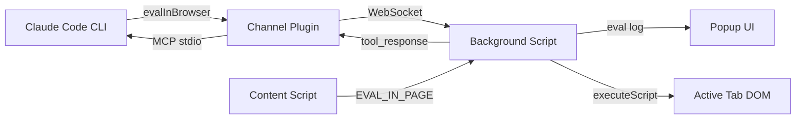

# SDS

## 1. Intro
- **Purpose:** Technical design for FoxCode Firefox extension
- **Rel to SRS:** Implements FR-1 through FR-6

## 2. Arch
- **Diagram:**

- **Subsystems:**
  - Channel Plugin (`foxcode/channel/`): Node.js MCP server, WebSocket bridge
  - Extension (`extension/`): Popup eval console, Background script, Content script

## 3. Components

### 3.1 Channel Plugin (`foxcode/channel/`)
- **`server.mjs`** - MCP server: WebSocket bridge, tool dispatch, graceful shutdown (stdin close / SIGTERM / SIGINT -> terminate WS clients, close server, exit). Reads name/version from `plugin.json` at runtime (single source of truth). HTTP endpoints: `GET /` serves info page (live status via polling), `GET /status` returns `{connectedClients}` JSON
- **`lib.mjs`** - Shared logic: ID generation, message builders, tool definitions, port management (`createHttpServer`, `portStorage`), password management (`passwordStorage`), `buildConnectionPage` (info page HTML with polling JS). File I/O limited to `portStorage` (`~/.foxcode/port`) and `passwordStorage` (`~/.foxcode/password`)
- **`validator.mjs`** - Code syntax validation (async-aware via `new Function` wrapper)
- **Capabilities:** `tools` (status, evalInBrowser)
- **Port binding:** Auto-binds to first available port in range 8787–8886. Priority: `FOXCODE_PORT` env -> saved port (`~/.foxcode/port`) -> random start with wrap-around. Saved on successful bind. Null-safe: runs without WebSocket if all ports taken (MCP stdio still works)
- **Interfaces:** stdio (MCP with CC), WebSocket `ws://localhost:{port}` (extension, dynamic port)
- **Tools exposed:**
  - `status()` - server telemetry (port, projectDir, uptime, connectedClients, pendingRequests, nodeVersion, serverVersion, pid, pluginRoot, launchMode, client). Always works, no browser required. `client` contains `{paramsSource, connectedAt}` from last extension ping
  - `evalInBrowser(code, timeout?)` - execute JS in browser with full API. Validates syntax, sends to extension via WebSocket, returns serialized result
- **Deps:** `@modelcontextprotocol/sdk`, `ws`

### 3.2 Background Script (`extension/background/`)
- **`background.js`** - Multi-session WebSocket manager. Maintains `sessions` Map (port → Session) for N simultaneous MCP server connections. Connect priority: URL hash params (all tabs) > saved sessions. `tabs.onUpdated` listener auto-connects new sessions from URL hash. Per-session reconnect with exponential backoff (3s→30s, max 10 attempts). `evalInBrowser` requests serialized via global queue (dead-session requests skipped). Buffers eval messages (200 cap FIFO) for popup replay. Badge shows unread eval count. No settings form.
- **`url-params.js`** - Parses connection params from tab URL hash (`#PORT:PASSWORD`). Returns array of `{port, password}` (all matches, deduplicated by port). Port validated against FoxCode range 8787–8886
- **`browser-api.js`** - Factory creating `api` object with ~36 async helpers + storage sub-methods (DI for testability)
- **`dom-helpers.js`** - Pure functions generating injectable JS code (buildWaitAndAct, selectors, etc.)
- **Execution model:** Agent code runs via `new Function('api', code)(browserApi)` in background (persistent, survives navigation). DOM ops delegated to tabs via `executeScript`. Navigation via `webNavigation.onCompleted`.
- **Managed tab:** `navigate()` creates a new active tab on first call. Subsequent navigations reuse and activate it. All API operations target managed tab. `closeTab()` resets; next `navigate()` creates fresh tab. `tabs.onRemoved` auto-clears state. `screenshot()` temporarily activates managed tab for capture, then restores focus.
- **Interfaces:** WebSocket (channel), port (popup), tabs.executeScript (DOM), tabs.sendMessage (content script for eval)
- **Deps:** Channel plugin running, CSP `unsafe-eval`

### 3.3 Popup Eval Console (`extension/popup/`)
- **`format.js`** - Pure formatting helpers: `formatParamValue` (string without JSON escaping, objects as pretty JSON), `formatToolParams` (key-value display)
- **`popup.js`** - Eval debug UI: displays evalInBrowser requests (tool_use) and responses (tool_result). Receives buffered messages from background on open. No session bar, no chat messages, no markdown
- **Interfaces:** port connection to background script (`name: 'popup'`)
- **Deps:** Background script

### 3.4 Content Script (`extension/content/content-script.js`)
- **Purpose:** EVAL_IN_PAGE handler - executes JS expressions in page main world via `wrappedJSObject` (Firefox-specific)
- **Interfaces:** runtime.onMessage listener (EVAL_IN_PAGE action)
- **Deps:** Active page DOM, wrappedJSObject access

## 4. Data
- **Entities:** Message (id, from, text, ts, replyTo?), ToolUse (id, tool, params, ts), ToolResult (id, tool, content, ts)
- **Port persistence:** Server saves last port to `~/.foxcode/port` (file). Extension saves session array `[{port, password}]` to `browser.storage.local` (`foxcode_sessions` key). Launch scripts pass port + password via URL hash for instant connection
- **Session data:** Messages, tool results - in-memory, per-session. Session meta (projectDir, version, pid) cached from pong

## 5. Logic
- **CC automates browser:** CC calls `evalInBrowser` -> channel validates syntax -> sends `EVAL_CODE` via WebSocket -> background executes via `new Function('api',code)(browserApi)` -> API helpers delegate to `executeScript`/`webNavigation`/`cookies`/etc -> result serialized -> returned to CC. tool_use/tool_result broadcast to popup (if open) and buffered for replay
- **Page main world eval:** `api.eval(expr)` -> background sends `EVAL_IN_PAGE` message to content script -> content script uses `wrappedJSObject.eval()` -> result returned
- **WebSocket protocol:** JSON messages with `type` field discriminator (`tool_request`, `tool_response`, `tool_use`, `tool_result`, `pong`). `pong` messages include `protocol_version` (integer) for compatibility checks. Background injects `sessionPort` into eval messages forwarded to popup. Popup messages: `session-update` (connection state), `buffered-messages` (replay on open)

## 6. Non-Functional
- **Fault Tolerance:** Per-session auto-reconnect with exponential backoff (3s -> 30s max, 10 attempts). Dead sessions removed from Map. Channel server graceful shutdown on parent CC exit (stdin EOF) prevents orphan processes.
- **Sec:** localhost-only WebSocket (`127.0.0.1`), no external traffic
- **Logs:** Channel outputs to stderr (visible in CC debug logs)

## 7. Constraints
- **One-way communication:** Popup is read-only eval debug display. No browser-to-CC messaging
- **CSP unsafe-eval required:** `evalInBrowser` uses `new Function()` in background - needs `"script-src 'self' 'unsafe-eval'"` in manifest CSP. Acceptable: code source is trusted (Claude Code agent)
- **api.eval() CSP-limited:** Page CSP may block `eval()` via wrappedJSObject on strict sites
- **No iframe support:** executeScript targets top frame only
- **No file upload:** Browser security prevents programmatic file path injection
- **Deferred:** Permission relay, iframe support, video/tracing

## 8. Distribution & Setup

### Primary: CC Plugin Marketplace
- **Structure:** `.claude-plugin/marketplace.json` (repo root) -> `foxcode/` (plugin dir)
- **Plugin contents:** `.claude-plugin/plugin.json` (manifest), `.mcp.json` (MCP server config), `skills/foxcode-run-project-profile/SKILL.md`, `skills/foxcode-run-user-profile/SKILL.md`
- **MCP auto-load:** Plugin `.mcp.json` declares `foxcode` server (`sh -c "cd ${CLAUDE_PLUGIN_ROOT}/channel && npm install && node server.mjs"`). Auto-installs deps on first run, loads automatically on plugin enable. No npm package needed.
- **Launch skills:** `/foxcode:foxcode-run-project-profile` (isolated Firefox via web-ext) and `/foxcode:foxcode-run-user-profile` (manual extension loading via about:debugging, auto-open connection page). Both self-contained: prereq check, locate extension, cache paths in `.foxcode/config.json`, launch/guide, verify connectivity
- **Bundled scripts** (`foxcode/skills/foxcode-run-project-profile/scripts/`): Python 3.9+ utilities shared by both skills
  - `resolve_env.py` — discovers Firefox binary (macOS/Linux/Windows), extension dir, reads port/password. Greenfield: saves to `.foxcode/config.json`. Brownfield: reads cache, re-discovers if stale. Output: `--format=json` or `--format=shell`
  - `launch_firefox.py` — calls `resolve_env` internally, launches web-ext with PID lifecycle (`.foxcode/web-ext.pid`): stale/live detection, cleanup on exit (SIGTERM/SIGHUP/normal)

### Idempotency
- `.xpi` download: detect existing file, ask re-download or skip
- Safe to re-run
