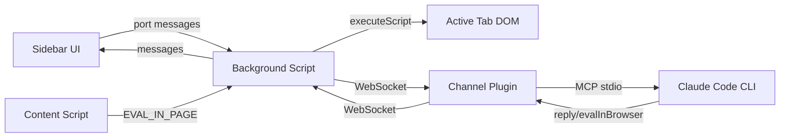

# SDS

## 1. Intro
- **Purpose:** Technical design for FoxCode Firefox extension
- **Rel to SRS:** Implements FR-1 through FR-5

## 2. Arch
- **Diagram:**

- **Subsystems:**
  - Channel Plugin (`foxcode/channel/`): Node.js MCP server, WebSocket bridge
  - Extension (`extension/`): Sidebar UI, Background script, Content script

## 3. Components

### 3.1 Channel Plugin (`foxcode/channel/`)
- **`server.mjs`** — MCP server: WebSocket bridge, tool dispatch, channel notifications, graceful shutdown (stdin close / SIGTERM / SIGINT → terminate WS clients, close server, exit). Reads name/version from `plugin.json` at runtime (single source of truth)
- **`lib.mjs`** — Shared logic: ID generation, message builders, tool definitions, port management (`createWebSocketServer`, `portStorage`). File I/O limited to `portStorage` (load/save `~/.foxcode/port`)
- **`validator.mjs`** — Code syntax validation (async-aware via `new Function` wrapper)
- **Capabilities:** `claude/channel` (notifications), `tools` (status, ping, reply, evalInBrowser)
- **Channel verification:** `ping` tool sends test message to browser via WebSocket; extension auto-replies `pong`. Returns `{forward, reverse}` booleans. `/foxcode:foxcode-run` calls `status` then `ping` as part of unified launch flow.
- **Port binding:** Auto-binds to first available port in range 8787–8886. Priority: `FOXCODE_PORT` env → saved port (`~/.foxcode/port`) → random start with wrap-around. Saved on successful bind. Null-safe: runs without WebSocket if all ports taken (MCP stdio still works)
- **Interfaces:** stdio (MCP with CC), WebSocket `ws://localhost:{port}` (extension, dynamic port)
- **Tools exposed:**
  - `status()` — server telemetry (port, projectDir, uptime, connectedClients, pendingRequests, nodeVersion, serverVersion, pid, pluginRoot). Always works, no browser required
  - `ping()` — test bidirectional connectivity (CC → browser → CC)
  - `reply(text, reply_to?)` — send CC response to browser
  - `evalInBrowser(code, timeout?)` — execute JS in browser with full API. Validates syntax, sends to extension via WebSocket, returns serialized result
- **Deps:** `@modelcontextprotocol/sdk`, `ws`

### 3.2 Background Script (`extension/background/`)
- **`background.js`** — Port discovery (scans 8787–8886 in batches of 20), WebSocket connection, message routing, EVAL_CODE handler. Supports `select-server`/`rescan` commands from sidebar. Persists last selected port in `browser.storage.local`
- **`browser-api.js`** — Factory creating `api` object with ~30 async helpers (DI for testability)
- **`dom-helpers.js`** — Pure functions generating injectable JS code (buildWaitAndAct, selectors, etc.)
- **Execution model:** Agent code runs via `new Function('api', code)(browserApi)` in background (persistent, survives navigation). DOM ops delegated to tabs via `executeScript`. Navigation via `webNavigation.onCompleted`.
- **Managed tab:** `navigate()` creates a new active tab on first call. Subsequent navigations reuse and activate it. All API operations target managed tab. `closeTab()` resets; next `navigate()` creates fresh tab. `tabs.onRemoved` auto-clears state. `screenshot()` temporarily activates managed tab for capture, then restores focus.
- **Interfaces:** WebSocket (channel), port (sidebar), tabs.executeScript (DOM), tabs.sendMessage (content script for eval)
- **Deps:** Channel plugin running, CSP `unsafe-eval`

### 3.3 Sidebar (`extension/sidebar/`)
- **`markdown.js`** — Pure markdown→HTML renderer (testable without DOM)
- **`format.js`** — Pure formatting helpers: `formatParamValue` (string without JSON escaping, objects as pretty JSON), `formatToolParams` (key-value display)
- **`sidebar.js`** — UI: message rendering (user, assistant, tool_use, tool_result), text input, thinking indicator, server picker (indicator + dropdown for multi-session switching, rescan button)
- **Interfaces:** port connection to background script
- **Deps:** Background script

### 3.4 Content Script (`extension/content/content-script.js`)
- **Purpose:** EVAL_IN_PAGE handler — executes JS expressions in page main world via `wrappedJSObject` (Firefox-specific)
- **Interfaces:** runtime.onMessage listener (EVAL_IN_PAGE action)
- **Deps:** Active page DOM, wrappedJSObject access

## 4. Data
- **Entities:** Message (id, from, text, ts, replyTo?), ToolUse (id, tool, params, ts), ToolResult (id, tool, content, ts)
- **Port persistence:** Server saves last port to `~/.foxcode/port` (file). Extension saves last selected port to `browser.storage.local`
- **Session data:** Messages, tool results — in-memory, session-scoped

## 5. Logic
- **Browser → CC:** Sidebar input → background → WebSocket → channel → `notifications/claude/channel` → CC
- **CC → Browser:** CC calls `reply` tool → channel → WebSocket → background → sidebar
- **CC automates browser:** CC calls `evalInBrowser` → channel validates syntax → sends `EVAL_CODE` via WebSocket → background executes via `new Function('api',code)(browserApi)` → API helpers delegate to `executeScript`/`webNavigation`/`cookies`/etc → result serialized → returned to CC
- **Page main world eval:** `api.eval(expr)` → background sends `EVAL_IN_PAGE` message to content script → content script uses `wrappedJSObject.eval()` → result returned
- **WebSocket protocol:** JSON messages with `type` field discriminator (`msg`, `edit`, `message`, `tool_request`, `tool_response`, `tool_use`, `tool_result`)

## 6. Non-Functional
- **Fault Tolerance:** Auto-reconnect with exponential backoff (3s → 30s max) + full port re-scan on each reconnect. Channel server graceful shutdown on parent CC exit (stdin EOF) prevents orphan processes.
- **Sec:** localhost-only WebSocket (`127.0.0.1`), no external traffic
- **Logs:** Channel outputs to stderr (visible in CC debug logs)

## 7. Constraints
- **Channels in research preview:** requires `--dangerously-load-development-channels plugin:foxcode@korchasa` flag. CC does not advertise `claude/channel` in MCP client capabilities — verification via `ping` tool instead.
- **Terminal messages invisible:** Messages initiated from terminal don't appear in browser (CC only calls `reply` for channel-initiated messages)
- **CSP unsafe-eval required:** `evalInBrowser` uses `new Function()` in background — needs `"script-src 'self' 'unsafe-eval'"` in manifest CSP. Acceptable: code source is trusted (Claude Code agent)
- **api.eval() CSP-limited:** Page CSP may block `eval()` via wrappedJSObject on strict sites
- **No iframe support:** executeScript targets top frame only
- **No file upload:** Browser security prevents programmatic file path injection
- **Deferred:** Permission relay, iframe support, video/tracing

## 8. Distribution & Setup

### Primary: CC Plugin Marketplace
- **Structure:** `.claude-plugin/marketplace.json` (repo root) → `plugins/foxcode/` (plugin dir)
- **Plugin contents:** `.claude-plugin/plugin.json` (manifest), `.mcp.json` (MCP server config), `commands/foxcode-install.md` (install command)
- **MCP auto-load:** Plugin `.mcp.json` declares `foxcode` server (`sh -c "cd ${CLAUDE_PLUGIN_ROOT}/channel && npm install && node server.mjs"`). Auto-installs deps on first run, loads automatically on plugin enable. No npm package needed.
- **Install command:** `/foxcode:foxcode-install` — interactive flow: prereq check (Node.js ≥18, Firefox) → locate extension source (local or marketplace clone) → launch Firefox with persistent profile → final summary with launch command

### Idempotency
- `.xpi` download: detect existing file, ask re-download or skip
- Safe to re-run
