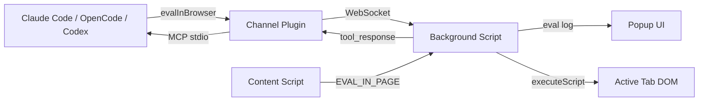

# SDS

## 1. Intro
- **Purpose:** Technical design for FoxCode Firefox extension
- **Rel to SRS:** Implements FR-1 through FR-6

## 2. Arch
- **Diagram:**

- **Subsystems:**
  - Channel Plugin (`foxcode/channel/`): Node.js MCP server, WebSocket bridge
  - Extension (`foxcode/extension/`): Popup eval console, Background script, Content script — bundled inside the plugin dir so CC plugin cache, marketplace clone, and OpenCode bundle all carry the same assets

## 3. Components

### 3.1 Channel Plugin (`foxcode/channel/`)
- **`server.mjs`** - MCP server: WebSocket bridge, tool dispatch, graceful shutdown (stdin close / SIGTERM / SIGINT -> terminate WS clients, close server, exit). Reads name/version from `plugin.json` at runtime (single source of truth). HTTP endpoints: `GET /` serves info page (live status via polling), `GET /status` returns `{connectedClients}` JSON
- **`lib.mjs`** - Shared logic: ID generation, message builders, tool definitions, port management (`createHttpServer`, `portStorage`), password management (`passwordStorage`), `buildConnectionPage` (info page HTML with polling JS). File I/O limited to `portStorage` (`~/.foxcode/port`) and `passwordStorage` (`~/.foxcode/password`)
- **`validator.mjs`** - Code syntax validation (async-aware via `new Function` wrapper)
- **Capabilities:** `tools` (status, evalInBrowser)
- **Port binding:** Auto-binds to first available port in range 8787–8886. Priority: `FOXCODE_PORT` env -> saved port (`~/.foxcode/port`) -> random start with wrap-around. Saved on successful bind. Null-safe: runs without WebSocket if all ports taken (MCP stdio still works)
- **Interfaces:** stdio (MCP with Claude Code / OpenCode / Codex), WebSocket `ws://localhost:{port}` (extension, dynamic port)
- **Tools exposed:**
  - `status()` - server telemetry (port, projectDir, uptime, connectedClients, pendingRequests, nodeVersion, serverVersion, pid, pluginRoot, launchMode, client). Always works, no browser required. `client` contains `{paramsSource, connectedAt}` from last extension ping
  - `evalInBrowser(code, timeout?)` - execute JS in browser with full API. Validates syntax, sends to extension via WebSocket, returns serialized result. DOM helpers accept CSS selectors only; text matching uses `api.eval(...)` or `api.snapshot()`.
- **Deps:** `@modelcontextprotocol/sdk`, `ws`

### 3.2 Background Script (`foxcode/extension/background/`)
- **`background.js`** - Multi-session WebSocket manager. Maintains `sessions` Map (port → Session) for N simultaneous MCP server connections. Connect priority: URL hash params (all tabs) > saved sessions. `tabs.onUpdated` listener auto-connects new sessions from URL hash. Per-session reconnect with exponential backoff (3s→30s, max 10 attempts). `evalInBrowser` requests serialized via global queue (dead-session requests skipped). Buffers eval messages (200 cap FIFO) for popup replay. Badge shows unread eval count. No settings form.
- **`url-params.js`** - Parses connection params from tab URL hash (`#PORT:PASSWORD`). Returns array of `{port, password}` (all matches, deduplicated by port). Port validated against FoxCode range 8787–8886
- **`browser-api.js`** - Factory creating `api` object with ~36 async helpers + storage sub-methods (DI for testability)
- **`dom-helpers.js`** - Pure functions generating injectable JS code (buildWaitAndAct, selectors, etc.)
- **Execution model:** Agent code runs via `new Function('api', code)(browserApi)` in background (persistent, survives navigation). DOM ops delegated to tabs via `executeScript`. Navigation via `webNavigation.onCompleted`.
- **Managed tab:** `navigate()` creates a new active tab on first call. Subsequent navigations reuse and activate it. All API operations target managed tab. `closeTab()` resets; next `navigate()` creates fresh tab. `tabs.onRemoved` auto-clears state. `screenshot()` temporarily activates managed tab for capture, then restores focus.
- **Interfaces:** WebSocket (channel), port (popup), tabs.executeScript (DOM), tabs.sendMessage (content script for eval)
- **Deps:** Channel plugin running, CSP `unsafe-eval`

### 3.3 Popup Eval Console (`foxcode/extension/popup/`)
- **`format.js`** - Pure formatting helpers: `formatParamValue` (string without JSON escaping, objects as pretty JSON), `formatToolParams` (key-value display)
- **`popup.js`** - Eval debug UI: displays evalInBrowser requests (tool_use) and responses (tool_result). Receives buffered messages from background on open. No session bar, no chat messages, no markdown
- **Interfaces:** port connection to background script (`name: 'popup'`)
- **Deps:** Background script

### 3.4 Content Script (`foxcode/extension/content/content-script.js`)
- **Purpose:** EVAL_IN_PAGE handler - executes JS expressions in page main world via `wrappedJSObject` (Firefox-specific)
- **Interfaces:** runtime.onMessage listener (EVAL_IN_PAGE action)
- **Deps:** Active page DOM, wrappedJSObject access

## 4. Data
- **Entities:** Message (id, from, text, ts, replyTo?), ToolUse (id, tool, params, ts), ToolResult (id, tool, content, ts)
- **Port persistence:** Server saves last port to `~/.foxcode/port` (file). Extension saves session array `[{port, password}]` to `browser.storage.local` (`foxcode_sessions` key). Launch scripts pass port + password via URL hash for instant connection
- **Session data:** Messages, tool results - in-memory, per-session. Session meta (projectDir, version, pid) cached from pong

## 5. Logic
- **Agent automates browser:** agent calls `evalInBrowser` -> channel validates syntax -> sends `EVAL_CODE` via WebSocket -> background executes via `new Function('api',code)(browserApi)` -> API helpers delegate to `executeScript`/`webNavigation`/`cookies`/etc -> result serialized -> returned over MCP. tool_use/tool_result broadcast to popup (if open) and buffered for replay
- **Page main world eval:** `api.eval(expr)` -> background sends `EVAL_IN_PAGE` message to content script -> content script uses `wrappedJSObject.eval()` -> result returned
- **WebSocket protocol:** JSON messages with `type` field discriminator (`tool_request`, `tool_response`, `tool_use`, `tool_result`, `pong`). `pong` messages include `protocol_version` (integer) for compatibility checks. Background injects `sessionPort` into eval messages forwarded to popup. Popup messages: `session-update` (connection state), `buffered-messages` (replay on open)

## 6. Non-Functional
- **Fault Tolerance:** Per-session auto-reconnect with exponential backoff (3s -> 30s max, 10 attempts). Dead sessions removed from Map. Channel server graceful shutdown on parent agent exit (stdin EOF) prevents orphan processes.
- **Sec:** localhost-only WebSocket (`127.0.0.1`), no external traffic
- **Logs:** Channel outputs to stderr (visible in agent debug logs)

## 7. Constraints
- **One-way communication:** Popup is read-only eval debug display. No browser-to-agent messaging
- **CSP unsafe-eval required:** `evalInBrowser` uses `new Function()` in background - needs `"script-src 'self' 'unsafe-eval'"` in manifest CSP. Acceptable: code source is trusted agent code
- **api.eval() CSP-limited:** Page CSP may block `eval()` via wrappedJSObject on strict sites
- **No iframe support:** executeScript targets top frame only
- **No file upload:** Browser security prevents programmatic file path injection
- **Deferred:** Permission relay, iframe support, video/tracing

## 8. Distribution & Setup

### MCP server: npm-distributed channel via npx (cross-IDE)
- **Source of truth:** `foxcode/channel/` — published to npm as the unscoped package `foxcode-channel` on every push to main with `feat/fix/perf/refactor/build` prefixes via `.github/workflows/ci.yml::auto-release`. CI uses `NPM_TOKEN` (GitHub Actions secret) and publishes `npm publish --access public --tag <latest|rc>`; rc dist-tag is derived from SemVer prereleases so they never pollute `latest`.
- **Pin shape (identical across IDEs):** `command = "npx"`, `args = ["-y", "foxcode-channel@<exact-version>"]`. No `cwd`, no `env` (except OpenCode's `FOXCODE_PROJECT_DIR={env:PWD}` interpolation to compensate for OpenCode's non-inheriting cwd). The exact version is pinned (no caret, no `latest`) so a stale registry never silently changes plugin behaviour.
- **Lockstep release:** `auto-release` bumps the SemVer in `foxcode/extension/manifest.json`, `foxcode/.claude-plugin/plugin.json`, `foxcode/channel/package.json` (+ lockfile), `opencode/package.json`, and rewrites every `foxcode-channel@…` literal in `foxcode/.mcp.json`, `scripts/build-plugin-payload.mjs`, `opencode/lib/foxcode-mcp-entry.mjs`. Post-publish gate (`npm view foxcode-channel@<ver>`) blocks the workflow if the tarball never reached the registry. `scripts/release.sh` mirrors the same edits as a local preview (no publish).
- **Manual publish path (rc):** `workflow_dispatch.channel_version` triggers `channel-publish` job which validates SemVer, refuses registry collisions, publishes with `--tag rc` for prereleases or `latest` for stable. Deprecate path: `workflow_dispatch.deprecate_range` triggers `channel-deprecate` job (`npm deprecate "foxcode-channel@<range>" "$MSG"`).

### Primary: CC Plugin Marketplace
- **Structure:** `.claude-plugin/marketplace.json` (repo root) -> `foxcode/` (plugin dir, self-contained: extension + skills + `.mcp.json` pointer to the npm channel)
- **Plugin contents:** `.claude-plugin/plugin.json` (manifest), `.mcp.json` (MCP server config), `extension/` (Firefox WebExtension assets), `skills/foxcode-run-project-profile/SKILL.md`, `skills/foxcode-run-user-profile/SKILL.md`. Channel sources live in `foxcode/channel/` in the repo (source of truth for the npm publish) but are not loaded from the plugin cache at runtime.
- **MCP auto-load:** Plugin `.mcp.json` declares `{"mcpServers":{"foxcode":{"command":"npx","args":["-y","foxcode-channel@<pinned>"]}}}`. Loads automatically on plugin enable. Channel is fetched from npm on first launch and cached by npx; no `npm ci` step runs on plugin load.
- **Launch skills:** `/foxcode:foxcode-run-project-profile` (isolated Firefox via web-ext) and `/foxcode:foxcode-run-user-profile` (manual extension loading via about:debugging, auto-open connection page). Both self-contained: prereq check, locate extension, cache paths in `.foxcode/config.json`, launch/guide, verify connectivity
- **Bundled scripts** (`foxcode/skills/foxcode-run-project-profile/scripts/`): Python 3.9+ utilities shared by both skills
  - `resolve_env.py` — discovers Firefox binary (macOS/Linux/Windows), extension dir. Greenfield: saves to `.foxcode/config.json`. Brownfield: reads cache, re-discovers if stale. Output: `--format=json` or `--format=shell`. Does NOT handle port/password — those come only from live MCP `status` (single source of truth; avoids stale `~/.foxcode/port` vs. running server mismatch)
  - `launch_firefox.py` — accepts `--port`/`--password` (passed by skill from `status` response), resolves Firefox+extension via `resolve_env`, launches web-ext as a detached process by default, writes `.foxcode/web-ext.pid`, then returns so the skill can poll `status`. Stale/live PID detection prevents duplicates; port mismatch kills the old process group and relaunches. Before launching, purges any staged macOS Firefox update markers under `~/Library/Caches/Mozilla/updates/.../0/` (`update.status`, `update.version`, `update.mar`, `Updated.app`, `active-update.xml`) and SIGTERMs any `org.mozilla.updater` process holding the FoxCode start URL. Launch always proceeds — no preflight block. The matching `--pref=app.update.*=false` flags then prevent the launched profile from re-staging on the same run. `--foreground` keeps supervising web-ext and cleans the PID file on exit for `scripts/dev.sh`. Without `--port`/`--password` (dev mode): no `--start-url`, extension auto-discovers via port scan; updater-process cleanup is also skipped (no URL marker to match)

### Secondary: OpenCode npm package (NF-7)
- **Structure:** sibling top-level dir `opencode/` (parallel to `foxcode/`). Published to npm as `@korchasa/foxcode-opencode`.
- **Package layout:** `index.mjs` (plugin entry), `lib/` (paths, seed-skills, mcp-snippet, patcher, handoff, exec, foxcode-mcp-entry, prereq, skill-frontmatter), `bin/foxcode-opencode.mjs` (CLI), `prepack.mjs` (bundle assembly), `bundle/` (created at pack time, contains `extension/`, `skills/` — channel is NOT bundled; it is fetched from npm at first MCP launch).
- **Plugin route:** user adds `"plugin": ["@korchasa/foxcode-opencode"]` to `opencode.json`; OpenCode auto-installs via Bun. On `session.created` (earliest plugin-callable hook) the plugin (a) symlinks bundled SKILL.md dirs into `~/.config/opencode/skills/foxcode-run-{project,user}-profile/`, (b) writes `~/.foxcode/opencode-plugin-dir` for Python helpers, (c) emits an MCP snippet to stderr exactly when `mcp.foxcode` is missing from project + global `opencode.json`. The snippet is built by `lib/foxcode-mcp-entry.mjs::buildFoxcodeMcpEntry()` and has shape `{type:"local", command:["npx","-y","foxcode-channel@<pinned>"], environment:{FOXCODE_PROJECT_DIR:"{env:PWD}"}, enabled:true}`. Snippet emitted at most once per process.
- **CLI route (one-shot):** `npx -y @korchasa/foxcode-opencode setup [--write-config]`. Same actions as the plugin, plus `--write-config` patches `opencode.json` directly (plain JSON only; refuses files with `//` or `/*` comments). `uninstall` removes seeded symlinks and the handoff file but never auto-removes `mcp.foxcode` (avoids destructive config mutation). `doctor` prints diagnostics.
- **Seed semantics:** symlink target check. `created` (new), `kept` (correct symlink), `replaced-dangling` (target moved by nvm/reinstall), `user-dir-kept` (real dir preserved), `copied-fallback` (Windows non-admin perm-denied → recursive copy).
- **Patcher actions:** `created` (file did not exist), `added-mcp` (mcp key absent), `added-foxcode` (mcp present, foxcode missing), `updated` (foxcode present with different value), `noop` (already correct).
- **Handoff (`~/.foxcode/opencode-plugin-dir`):** absolute path to plugin root. `resolve_env.py::find_extension_dir` reads this file (mode 0644) before falling back to the in-plugin extension path (`<plugin>/extension`). Mirrors the existing `~/.foxcode/port` / `~/.foxcode/password` pattern — env-var propagation through subprocess chains is unreliable.
- **Version sync:** `prepack.mjs` reads `version` from `foxcode/.claude-plugin/plugin.json` (single source of truth) and writes it back into `opencode/package.json` before pack. Keeps CC + OpenCode releases aligned.
- **Bundle exclusions:** `prepack.mjs` excludes `node_modules/`, `.foxcode/`, `build/`, `.DS_Store` from the copied trees. Channel is never bundled — it resolves from npm via `npx` at MCP launch.
- **Subprocess strategy:** `lib/exec.mjs` wraps `node:child_process.spawn` (no Bun-only `$` template tag) — single code path under both Bun (OpenCode plugin sandbox) and Node (CLI / dev).
- **Tier-4 skill acceptance:** `scripts/test-ide-skill.sh` runs `opencode run --command foxcode-run-project-profile`, requires exactly one `foxcode_evalInBrowser`, verifies DuckDuckGo metadata plus third result, and cleans only the web-ext PID it created.

### Tertiary: Codex (NF-8)
- **Repo-scoped install:** `.codex/config.toml` declares project-scoped `mcp_servers.foxcode` with the npx form (`command = "npx"`, `args = ["-y", "foxcode-channel@<pinned>"]`); `.agents/skills/foxcode-run-{project,user}-profile/` exposes launch skills; `.agents/skills/foxcode-{acceptance,distribution}-testing/` exposes project QA; `.agents/skills/foxcode-usage-analysis/` analyzes historical Codex/Claude usage. `.claude/skills` is a symlink to `../.agents/skills` so Claude Code and Codex share one skill source.
- **Marketplace install:** `codex plugin marketplace add korchasa/foxcode` registers the marketplace and caches the static payload (skills + Firefox extension) under `~/.codex/plugins/cache/korchasa/foxcode/<version>/`. The MCP server itself is declared in `~/.codex/config.toml` with the npx pin (Codex does not start MCP servers declared in plugin `.mcp.json` — upstream issue #19372). The payload is built by `scripts/build-plugin-payload.mjs`; `CHANNEL_SPEC` (= `foxcode-channel@<pinned>`) is bumped in lockstep by the release flow.
- **MCP startup:** Codex spawns `npx -y foxcode-channel@<pinned>`. The child inherits Codex's cwd (the user's project dir), so `resolveProjectDir(env)` returns `process.cwd()` matching the user project. `FOXCODE_PROJECT_DIR` remains as an explicit override.
- **Skill strategy:** Codex wrapper launch skills delegate to canonical `foxcode/skills/*/SKILL.md` and only adapt script paths from `${CLAUDE_SKILL_DIR}` to repo-relative paths.
- **Verification:** `codex mcp get foxcode` and `codex mcp list --json` show the active MCP entry. Tier-4 e2e includes runtime `codex` via `@korchasa/ai-ide-cli`.

### Idempotency
- `.xpi` download: detect existing file, ask re-download or skip
- Safe to re-run
- OpenCode plugin/CLI: `seedSkills` and `patchOpencodeJson` are idempotent by construction — second run is a no-op when state already matches.
- Codex repo support: `.codex/config.toml`, `.agents/skills/*`, and the `.claude/skills` symlink are static project files; re-running Codex/Claude Code reuses the same skill source.
