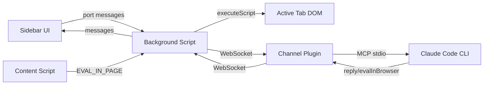

# SDS

## 1. Intro
- **Purpose:** Technical design for FoxCode Firefox extension
- **Rel to SRS:** Implements FR-1 through FR-5

## 2. Arch
- **Diagram:**

- **Subsystems:**
  - Channel Plugin (`channel/`): Bun/Node MCP server, WebSocket bridge
  - Extension (`extension/`): Sidebar UI, Background script, Content script

## 3. Components

### 3.1 Channel Plugin (`channel/`)
- **`server.mjs`** — MCP server: WebSocket bridge, tool dispatch, channel notifications
- **`lib.mjs`** — Pure logic: ID generation, message builders, tool definitions (testable without MCP/WS)
- **`validator.mjs`** — Code syntax validation (async-aware via `new Function` wrapper)
- **Capabilities:** `claude/channel` (notifications), `tools` (reply, evalInBrowser)
- **Startup check:** `oninitialized` callback verifies client advertises `experimental['claude/channel']` capability. If absent (CC launched without `--dangerously-load-development-channels`), exits with FATAL error and actionable command. Logic: `lib.mjs:assertChannelCapability()`, wired in `server.mjs:oninitialized`.
- **Interfaces:** stdio (MCP with CC), WebSocket `ws://localhost:8787` (extension)
- **Tools exposed:**
  - `reply(text, reply_to?)` — send CC response to browser
  - `edit_message(message_id, text)` — edit previous message
  - `evalInBrowser(code, timeout?)` — execute JS in browser with full API. Validates syntax, sends to extension via WebSocket, returns serialized result
- **Deps:** `@modelcontextprotocol/sdk`, `ws`

### 3.2 Background Script (`extension/background/`)
- **`background.js`** — WebSocket connection, message routing, EVAL_CODE handler, context menu
- **`browser-api.js`** — Factory creating `api` object with ~30 async helpers (DI for testability)
- **`dom-helpers.js`** — Pure functions generating injectable JS code (buildWaitAndAct, selectors, etc.)
- **Execution model:** Agent code runs via `new Function('api', code)(browserApi)` in background (persistent, survives navigation). DOM ops delegated to tabs via `executeScript`. Navigation via `webNavigation.onCompleted`.
- **Managed tab:** `navigate()` creates a new active tab on first call. Subsequent navigations reuse and activate it. All API operations target managed tab. `closeTab()` resets; next `navigate()` creates fresh tab. `tabs.onRemoved` auto-clears state. `screenshot()` temporarily activates managed tab for capture, then restores focus.
- **Interfaces:** WebSocket (channel), port (sidebar), tabs.executeScript (DOM), tabs.sendMessage (content script for eval)
- **Deps:** Channel plugin running, CSP `unsafe-eval`

### 3.3 Sidebar (`extension/sidebar/`)
- **`markdown.js`** — Pure markdown→HTML renderer (testable without DOM)
- **`format.js`** — Pure formatting helpers: `formatParamValue` (string without JSON escaping, objects as pretty JSON), `formatToolParams` (key-value display)
- **`sidebar.js`** — UI: message rendering (user, assistant, tool_use, tool_result), text input, thinking indicator
- **Interfaces:** port connection to background script
- **Deps:** Background script

### 3.4 Content Script (`extension/content/content-script.js`)
- **Purpose:** EVAL_IN_PAGE handler — executes JS expressions in page main world via `wrappedJSObject` (Firefox-specific)
- **Interfaces:** runtime.onMessage listener (EVAL_IN_PAGE action)
- **Deps:** Active page DOM, wrappedJSObject access

## 4. Data
- **Entities:** Message (id, from, text, ts, replyTo?), ToolUse (id, tool, params, ts), ToolResult (id, tool, content, ts)
- **No persistent storage**: All data session-scoped, in-memory

## 5. Logic
- **Browser → CC:** Sidebar input → background → WebSocket → channel → `notifications/claude/channel` → CC
- **CC → Browser:** CC calls `reply` tool → channel → WebSocket → background → sidebar
- **CC automates browser:** CC calls `evalInBrowser` → channel validates syntax → sends `EVAL_CODE` via WebSocket → background executes via `new Function('api',code)(browserApi)` → API helpers delegate to `executeScript`/`webNavigation`/`cookies`/etc → result serialized → returned to CC
- **Page main world eval:** `api.eval(expr)` → background sends `EVAL_IN_PAGE` message to content script → content script uses `wrappedJSObject.eval()` → result returned
- **WebSocket protocol:** JSON messages with `type` field discriminator (`msg`, `edit`, `message`, `tool_request`, `tool_response`, `tool_use`, `tool_result`)

## 6. Non-Functional
- **Fault Tolerance:** Auto-reconnect with exponential backoff (3s → 30s max)
- **Sec:** localhost-only WebSocket (`127.0.0.1`), no external traffic
- **Logs:** Channel outputs to stderr (visible in CC debug logs)

## 7. Constraints
- **Channels in research preview:** requires `--dangerously-load-development-channels server:foxcode` flag. Server validates this at init via client capabilities check and exits if missing.
- **Terminal messages invisible:** Messages initiated from terminal don't appear in browser (CC only calls `reply` for channel-initiated messages)
- **CSP unsafe-eval required:** `evalInBrowser` uses `new Function()` in background — needs `"script-src 'self' 'unsafe-eval'"` in manifest CSP. Acceptable: code source is trusted (Claude Code agent)
- **api.eval() CSP-limited:** Page CSP may block `eval()` via wrappedJSObject on strict sites
- **No iframe support:** executeScript targets top frame only
- **No file upload:** Browser security prevents programmatic file path injection
- **Deferred:** Plugin marketplace packaging, permission relay, iframe support, video/tracing

## 8. Setup Automation (`install-prompt.md`)

- **Purpose:** Markdown file containing a prompt for Claude Code that automates project setup
- **Location:** Repo root `install-prompt.md`
- **Format:** Prose instructions for CC agent — not a shell script. CC interprets and executes steps using its tools.

### Automated Steps (CC executes)
1. **Prereq check**: verify `node --version` ≥18, `firefox --version` exists (or `open -a Firefox` on macOS), `claude --version` ≥2.1.80
2. **Deps install**: `npm install` in `channel/`
3. **Smoke test**: `node -e "require('./channel/server.mjs')"` or quick syntax check — verify no startup crash
4. **Configure .mcp.json**: Create/merge `.mcp.json` in CWD (target project) with `{"mcpServers":{"foxcode":{"command":"node","args":["<abs-path>/channel/server.mjs"]}}}`
5. **Configure CC permissions**: Add `foxcode` MCP server to allowed in `~/.claude/settings.json` or `.claude/settings.local.json`
6. **Verify**: Confirm `.mcp.json` is valid JSON, paths resolve

### Extension Install (CC asks user, then acts)
1. CC downloads `foxcode-extension.xpi` from GitHub releases to `/tmp/`
2. CC asks user: **A) Separate window** (clean profile via `web-ext run`) or **B) Existing Firefox** (manual load via `about:debugging`)
3. **Option A:** CC runs `npx web-ext run --source-dir <repo>/extension` — launches isolated Firefox with extension pre-loaded
4. **Option B:** CC outputs manual steps: `about:debugging` → Load Temporary Add-on → select `/tmp/foxcode-extension.xpi`
5. User restarts CC session with `--dangerously-load-development-channels server:foxcode`

### Idempotency
- `.mcp.json`: merge `foxcode` entry, preserve other servers
- `npm install`: safe to re-run
- Permissions: additive, no overwrites
- Skip steps if already done (check before act)
